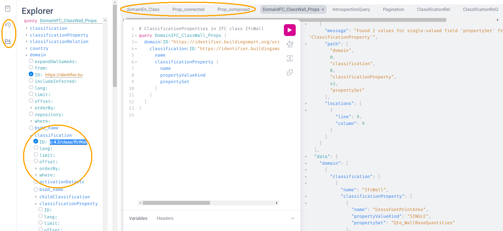

- [Abstract](#abstract)
- [Introduction](#introduction)
  - [bSDD](#bsdd)
  - [GraphQL Benefits](#graphql-benefits)
  - [Original GraphQL bSDD Schema: Voyager](#original-graphql-bsdd-schema-voyager)
  - [Original GraphQL bSDD Schema: Problems](#original-graphql-bsdd-schema-problems)
  - [Refactored GraphQL bSDD Schema: Voyager](#refactored-graphql-bsdd-schema-voyager)
  - [GraphiQL Querying of Original Endpoint](#graphiql-querying-of-original-endpoint)
  - [GraphiQL Querying of Refactored Endpoint](#graphiql-querying-of-refactored-endpoint)
  - [Files](#files)
  - [Endpoints and Pages](#endpoints-and-pages)
- [Original bSDD Data](#original-bsdd-data)
  - [Getting bSDD Data Dumps](#getting-bsdd-data-dumps)
  - [Statistics](#statistics)
    - [Total Entities](#total-entities)
    - [Classifications Per Domain](#classifications-per-domain)
    - [Fields Used](#fields-used)
    - [Fields Used in Classification](#fields-used-in-classification)
    - [Fields Used in ClassificationProperty](#fields-used-in-classificationproperty)
    - [Fields Used in Property](#fields-used-in-property)
    - [Fields Used in PropertyValue](#fields-used-in-propertyvalue)
  - [Key Fields](#key-fields)
    - [ClassificationType](#classificationtype)
    - [PropertyValueKind of ClassificationProperty](#propertyvaluekind-of-classificationproperty)
    - [PropertyValueKind of Property](#propertyvaluekind-of-property)
    - [Status](#status)
    - [Dynamic Properties](#dynamic-properties)
    - [isWritable Property](#iswritable-property)
    - [isRequired Property](#isrequired-property)
    - [Domains with isWritable and isRequired Properties](#domains-with-iswritable-and-isrequired-properties)
- [Suggested Improvements](#suggested-improvements)
  - [Return the Same Data Across APIs](#return-the-same-data-across-apis)
  - [Improve Property Names](#improve-property-names)
  - [Use the Same URL for Data and for Web Pages](#use-the-same-url-for-data-and-for-web-pages)
  - [Improve URL Structure and Consistency](#improve-url-structure-and-consistency)
    - [Explicate Domain Versions](#explicate-domain-versions)
    - [Declare URLs to be `ID` and Use a Mandatory Field `id`](#declare-urls-to-be-id-and-use-a-mandatory-field-id)
    - [Overlap of Entity Classes with `classificationType`](#overlap-of-entity-classes-with-classificationtype)
    - [Property vs ClassificationProperty: Use Distinct URLs](#property-vs-classificationproperty-use-distinct-urls)
    - [All Entities Should Have URL](#all-entities-should-have-url)
  - [Modeling Issues](#modeling-issues)
    - [Modeling of Complex Properties](#modeling-of-complex-properties)
    - [Modeling of Dynamic Properties](#modeling-of-dynamic-properties)
    - [Improve Relations Between Entities](#improve-relations-between-entities)
    - [Add More Entities](#add-more-entities)
    - [Use Class Inheritance](#use-class-inheritance)
    - [Improve Description of ClassificationProperties](#improve-description-of-classificationproperties)
    - [Improve Representation of PropertyValues](#improve-representation-of-propertyvalues)
    - [Improve Representation of predefinedValue](#improve-representation-of-predefinedvalue)
    - [Improve Multilingual Support](#improve-multilingual-support)
  - [Improve RDF Structure](#improve-rdf-structure)
  - [GraphQL Improvements](#graphql-improvements)
    - [Searchability and Pagination](#searchability-and-pagination)
    - [Eliminate Parallel Links Between Entities](#eliminate-parallel-links-between-entities)
    - [GraphQL Arrays and Nullability](#graphql-arrays-and-nullability)
    - [Null Classifications Error](#null-classifications-error)
    - [Null Classification Childs Error](#null-classification-childs-error)
    - [Null ClassificationProperty Name Error](#null-classificationproperty-name-error)
    - [Missing Domains](#missing-domains)
    - [Unexpected Multiple Values](#unexpected-multiple-values)
    - [Deprecated Properties](#deprecated-properties)
  - [Data Quality Problems](#data-quality-problems)
    - [Trim Leading, Trailing, Consecutive Whitespace](#trim-leading-trailing-consecutive-whitespace)
    - [Improve Physical Quantities and Units](#improve-physical-quantities-and-units)
    - [Rules About Missing Data](#rules-about-missing-data)
    - [Unicode Problems](#unicode-problems)
    - [Unresolved HTML Entities](#unresolved-html-entities)
- [Implementing Improvements](#implementing-improvements)
  - [Converting JSON to Raw RDF using SPARQL Anything](#converting-json-to-raw-rdf-using-sparql-anything)
    - [Raw JSON Example](#raw-json-example)
    - [Raw RDF Example](#raw-rdf-example)
  - [Refactoring RDF using SPARQL Update](#refactoring-rdf-using-sparql-update)
    - [Original RDF Example](#original-rdf-example)
    - [Refactored RDF Example](#refactored-rdf-example)
  - [GraphQL to SOML and Back](#graphql-to-soml-and-back)
  - [Sample Queries](#sample-queries)
    - [Domains with lang=EN and their Classifications](#domains-with-lang-en-and-their-classifications)
    - [ClassificationProperties in IFC class IfcWall](#classificationproperties-in-ifc-class-ifcwall)
    - [Classifications of Type COMPOSED\_PROPERTY and their Constituent Properties](#classifications-of-type-composed-property-and-their-constituent-properties)
    - [Properties that Have Connected Properties](#properties-that-have-connected-properties)
    - [Pagination](#pagination)
    - [Classifications with Relations](#classifications-with-relations)
    - [Relations of Classifications](#relations-of-classifications)
    - [Length Properties](#length-properties)
- [Acknowledgements](#acknowledgements)


<a id="abstract"></a>

# Abstract

The buildingSmart Data Dictionary (bSDD) is an important shared resource in the Architecture, Engineering, Construction, and Operations (AECO) domain. It is a collection of datasets ("domains") that define various classifications (objects representing building components, products, and materials), their properties, allowed values, etc. bSDD defines a GraphQL API, as well as REST APIs that return JSON and RDF representations. This improves the interoperability of bSDD and its easier deployment in architectural Computer Aided Design (CAD) and other AECO software.

However, bSDD data is not structured as well as possible, and data retrieved via different APIs is not identical in content and structure. This lowers bSDD data quality, usability and trust.

We conduct a thorough comparison and analysis of bSDD data related to fulfillment of FAIR (findable, accessible, interoperable, and reusable) principles. Based on this analysis, we suggest enhancements to make bSDD data better structured and more FAIR.

We implement many of the suggestions by refactoring the original data to make it better structured/interconnected, and more "semantic". We provide a SPARQL endpoint using [Ontotext GraphDB](https://graphdb.ontotext.com/), and GraphQL endpoint using [Ontotext Platform Semantic Objects](https://platform.ontotext.com/semantic-objects/). Our detailed work is available at <https://github.com/Accord-Project/bsdd> (open source) and <https://bsdd.ontotext.com> (home page, schemas, data, sample queries).


<a id="introduction"></a>

# Introduction


<a id="bsdd"></a>

## bSDD

Reusable data dictionaries are widely used for the electronic exchange of product and component information across industries, improving interoperation between systems. Examples include:

-   [IEC Common Data Dictionary](https://cdd.iec.ch/) (IEC CDD): electrical components, units of measure, documents and certificates, etc.
-   [eCl@ss](https://eclass.eu/en/): a product classification and parts description for a variety of industries.
-   ISO 15926 part 4 [Reference Data and Services](https://rds.posccaesar.org/): for digital information across process plant industries (oil & gas).
-   [buildingSMART Data Dictionary (bSDD)](https://bsdd.buildingsmart.org/): for materials and components in the AECO industry.

The bSDD is a hierarchical dictionary of object concepts (Classifications), their Properties and allowed values used in Building Information Models (BIM). Property sets are predefined by regulation agencies and vendors and extend common property sets of the Industry Foundation Classes (IFC). This allows to describe specific domains (e.g. transportation) and building elements (e.g. doors, windows, stairs). bSDD is organized according to the ISO 23386 (2020) Methodology to describe, author and maintain properties in interconnected data dictionaries. This is a language-independent model used for the development of dictionaries according to ISO 12006-3 (2022) Framework for object-oriented information.

bSDD was initiated to improve interoperability in the building and construction industry. bSDD is a comprehensive solution that provisions open product data definitions, identification, and distribution methods.

As of February 2023, bSDD has keeps descriptions of nearly 80,000 Classifications in 108 domains, ranging from roads and rails to DIN, Omniclass, Uniclass, IFC extensions, etc. It is a widely accepted source of BIM reference data. bSDD uses URLs for nearly all defined entities to enable globalized data use in a variety of AECO applications and structured documents.


<a id="graphql-benefits"></a>

## GraphQL Benefits

[GraphQL](https://graphql.org/) as an approach to create simplified "facades" over various storages, and to provide schema, uniform query language, API and runtime for handling queries, mutations and subscriptions. It has many benefits over traditional REST APIs:

-   Avoid over-fetching by specifying exactly which data and in what nested structure should be returned by the server
-   Data is returned in JSON that is precisely congruent to the shape of the query
-   Retrieve many resources in a single request; even across storages by using GraphQL Federation
-   Schema introspection that allows IDEs and query helpers to offer contextual auto-completion at any point in the query
-   Data validation (for both input through mutations and output through queries) that guarantees type and cardinality conformance (optional/mandatory, single/multi-valued)

bSDD does offer GraphQL access:

-   Test: <https://test.bsdd.buildingsmart.org/graphiql/>
-   Production: <https://api.bsdd.buildingsmart.org/graphqls/> (secured endpoint).
-   NOTE: we worked with bSI to get access to the production endpoint, but due to delays all our analysis is done on data from the test endpoint. Nevertheless, we believe that most of our findings also apply to the production data.

These use `GraphiQL`, which is a graphical interactive in-browser GraphQL IDE, available at


<a id="original-graphql-bsdd-schema-voyager"></a>

## Original GraphQL bSDD Schema: Voyager

[GraphQL Voyager](https://ivangoncharov.github.io/graphql-voyager/) (see [source](https://github.com/IvanGoncharov/graphql-voyager)) is a visual app that uses a Schema Introspection query (`schemaIntrospection.graphql`) to explore a GraphQL endpoint and displays the schema of the endpoint, allowing the user to search and browse the available types and queries.

We wrote a page [bsdd-graphql-voyager-orig](https://rawgit2.com/Accord-Project/bsdd/main/bsdd-graphql-voyager-orig.html) (see `bsdd-graphql-voyager-orig.html`) that deploys Voyager over the bSDD GraphQL endpoint. We used it to investigate the original bSDD schema:

")

As we can see, bSDD has 12 entities (object types):

-   Reference entities:
    -   `Country`
    -   `Language`
    -   `ReferenceDocument`, such as a standard
    -   `Unit`: unit of measure
-   `Domain`: dataset by a single data provider
-   `Property`: global property definition
    -   `PropertyRelation`: relation between properties
    -   `PropertyValue`: allowed property value for enumerated properties
-   `Classification`: object, material, component
    -   `ClassificationRelation`: relation between classifications
-   `ClassificationProperty`: property that is localized to a classification
    -   `ClassificationPropertyValue`: allowed property value for enumerated properties

We can also look at details of the schema:


Last but not least, Voyager presents detailed and searchable documentation about the schema; the same is available in the GraphiQL query tool.


<a id="original-graphql-bsdd-schema-problems"></a>

## Original GraphQL bSDD Schema: Problems

Even in the Schema Overview (at low level of detail) we can notice some defects:

-   The reference entities (`Country, Language, ReferenceDocument, Unit`) are disconnected from the rest of the schema, i.e. not used by the other entities
-   Relation entities have only an incoming link but no outgoing link. This means that if you want to get some data of a `Classification` and all its related `Classifications`, you need to issue two queries because you cannot navigate past `ClassificationRelation`.
-   Many entities cannot be queried directly from the root, but have to be reached through their respective "parent" entity.
-   There are no backward relations (arrows) to get from a lower-level entity back to its "parent" entity.
-   There are a number of parallel relations (arrows). This is not needed in GraphQL because the schema can use parameters to distinguish between the different uses.

At the high level of detail we can notice more defects:

-   `Property` and `ClassificationProperty` are very similar, but there's no inheritace/relation between them
-   `PropertyValue` and `ClassificationPropertyValue` are exactly the same, so can be reduced to one entity

We'll have a lot more to say about this in further sections. But first let's look at a refactored (improved) schema.


<a id="refactored-graphql-bsdd-schema-voyager"></a>

## Refactored GraphQL bSDD Schema: Voyager

The main purpose of this work is to refactor the bSDD data and schema in order to improve them. We explain the refactoring process in the last section.

But we show the refactored schema here in order to compare it to the original schema. We wrote the web page [bsdd-graphql-voyager-refact.html](https://rawgit2.com/Accord-Project/bsdd/main/bsdd-graphql-voyager-refact.html) (see `bsdd-graphql-voyager-refact.html`) that allows you to explore the refactored schema.

")

Improvements:

-   All entities are queryable directly from the root. Note: There's a common interface `Object` that provides functionality common to all entities: the dashed arrows show that each entity implements it. This creates some clutter in the diagram, but doesn't complicate querying and navigation.
-   There are no parallel arrows (relations) between entities; each relation is named the same as the target entity, improving predictability and consistency.
-   Navigation between entities is bidirectional (e.g. `Domain.classification` but also `Classification.domain`), which is a feature expected of a Knowledge Graph.
    -   In particular, the `Classification` hierarchy can be navigated both up and down (`parentClassification, childClassification`)
-   A query can traverse a `Relation` entity to get data about the related entity:
    -   `Classification.relation -> ClassificationRelation.related -> Classification`
    -   `Property.relation -> PropertyRelation.related -> Property`
-   A single entity `PropertyValue` is used by both `Property` and `ClassificationProperty`

This does not fix all defects noted with the original diagram. The reference entities are still not used by the main entities. To fix that would require data cleaning work (eg to ensure that Unit code strings used in all Properties and ClassificationProperties are in the reference list). Further

We can also take a look at a detail of the refactored schema. It looks pretty similar, but all fields are normalized to singular names, and strings fields like `propertyNamespaceUri` are converted to object fields like `Property`.


<a id="graphiql-querying-of-original-endpoint"></a>

## GraphiQL Querying of Original Endpoint

<https://test.bsdd.buildingsmart.org/graphiql> is the original GraphQL endpoint.


It provides a number of useful features:

-   Online searchable documentation of the GraphQL schema
-   Auto-completion of field names and parameters at any point in the query: queries practically "write themselves"!
-   Ability to parameterize queries through Query Variables
-   Code formatting (Prettifying) of the query
-   Syntax highlighting
-   History of previous queries
-   JSON results that conform exactly to the form of hate query


<a id="graphiql-querying-of-refactored-endpoint"></a>

## GraphiQL Querying of Refactored Endpoint

<https://bsdd.ontotext.com/graphiql/> is the refactored GraphQL endpoint:



We have deployed a newer version of GraphiQL that has all benefits described in the previous section, and adds some more:

-   A hierarchical Explorer pane that shows the total schema structure and allows you to select fields by clicking rather than typing. The History and Documentation panes are still present (see toggles at the left edge)
-   Useful keyboard shortcuts
-   Search in the query text (in addition to search in the Documentation)
-   Improved syntax highlighting
-   Multiple query tabs so you can easily access several queries at once
-   The query response reports errors in addition to returning data (this comes from our GraphQL server implementation, not from the GraphiQL version)


<a id="files"></a>

## Files

Description of all files in <https://github.com/Accord-Project/bsdd>:

-   `bsdd-graphql-schema-orig.json`, 116k: original GraphQL schema, obtained with `schemaIntrospection.graphql`
-   `bsdd-graphql-schema-refact.json`, 867k: refactored GraphQL schema, obtained with `schemaIntrospection.graphql`. The endpoint is generated with [Ontotext Platform Semantic Objects](https://platform.ontotext.com/semantic-objects/). The reason it is so much bigger is that it includes a comprehensive `where` query language
-   `bsdd-graphql-soml-template.yaml`: template file for the GraphQL-SOML generator
-   `bsdd-graphql-soml-orig.yaml`: draft [SOML](https://platform.ontotext.com/semantic-objects/soml/index.html) generated from the original GraphQL schema
-   `bsdd-graphql-soml-refact.yaml`: SOML refactored by hand to make structural improvements. We use this with [Ontotext Platform Semantic Objects](https://platform.ontotext.com/semantic-objects/) to generate the refactored GraphQL endpoint
-   `bsdd-graphql-soml.patch`: difference between the two SOML schemas
-   `bsdd-graphql-voyager-orig.html`: HTML page that displays the original GraphQL schema with Voyager
-   `bsdd-graphql-voyager-refact.html`:HTML page that displays the refactored GraphQL schema with Voyager
-   `bsdd-ontology.ttl`: start of a bSDD ontology, very incomplete (just declares some `owl:inverseOf`)
-   `bsdd-ontology.ru`: SPARQL update that implements `owl:inverseOf` (no need to use when we enable inverse reasoning)
-   `README.org`: detailed description of the work we did in emacs `orgmode` (this file)
-   `README.md`: detailed description of the work we did, exported to `markdown`
-   `README.html`: HTML rendition of the work we did
-   `index.md`: home page in markdown, with some advanced CSS tricks
-   `index.html`: home page in HTML
-   `Makefile`: make `index.html` with pandoc and `bsdd-graphql-soml.patch` with diff.
-   `paper`: paper submitted to LDAC 2023
    -   `bsdd.bib`: bibtex file for the paper, made from the [Zotero semantic BIM library](https://www.zotero.org/groups/3007408/semantic_bim), we don't use it
    -   `bsdd.biblatex`: biblatex file for the paper, made from the same library, we use this one
    -   `Makefile`: update the bibliography files
    -   `paper.md`: paper as markdown
    -   `paper.tex`: paper as latex, generated with Scholarly Pandoc
    -   `paper.pdf`: paper as PDF
-   `graphql`:
    -   GraphQL queries to get the 9 kinds of entities from the original GraphQL endpoint
    -   Also `schemaIntrospection.graphql` that gets the GraphQL schema of an endpoint
-   `graphql-refact`:
    -   Some sample queries against the refactored GraphQL endpoint (TODO: add more?)
-   `scripts`: all necessary scripts to export data in various formats, convert bSDD schema to SOML, convert JSON to RDF, refactor RDF, etc
    -   `bsdd2json.py`: connects to the original GraphQL API and exports all objects of the GraphQL schema as JSON (domains, classifications, classification properties, etc). There is no way to get more than 5000 classifications per domain (a limitation of the `classificationSearch` field)
    -   `bsdd_export.py`: export one kind of bSDD entity using a specific GraphQL query
    -   `bsdd_graphql_api.py`: helper module for working with the bSDD GraphQL endpoint
    -   `graphql2soml.py`: generates a draft SOML from a GraphQL endpoint
    -   `list-zip.sparql`: list all files in a zip using SPARQL Anything
    -   `rdfize.sparql`: RDFize a bSDD JSON file using SPARQL Anything
    -   `rdfize-folder.sparql`: RDFize a folder of bSDD JSON files using SPARQL Anything
    -   `rdfize-zip.sparql`: RDFize a zip of bSDD JSON files using SPARQL Anything (doesn't work: <https://github.com/SPARQL-Anything/sparql.anything/issues/335>)
    -   `transform.ru`: transform (refactor) RDF data. Described in detail below
-   `dump`: scripts to get the complete original bSDD data from the original GraphQL endpoint
    -   `docker-compose.yaml, Dockerfile`: docker files
    -   `dump.sh`: perform the dump
    -   `sparql-anything.bat`: batch file to invoke SPARQL Anything
-   `samples`: sample bSDD entities: whole sets (e.g. `units`) or selected "interesting" entities with most fields filled (e.g. `class-IfcWall, prop-Ifc-ACResistance`)
    -   `*-orig.json`: original files from GraphQL endpoint or JSON API
    -   `*-orig.ttl`: original files from RDF API (not all can be obtained this way, e.g. Domains cannot)
    -   `*-refact.ttl`: refactored RDF files
    -   `Makefile` to export and convert data


<a id="endpoints-and-pages"></a>

## Endpoints and Pages

Description of all endpoints that this project worked with and produced:

-   <https://bsdd.ontotext.com>: home page, includes all of these links
-   <https://bsdd.ontotext.com/README.html>: detailed description of the work we did (TODO from .org or .md?)
-   <https://bsdd.ontotext.com/> TODO paper
-   <https://test.bsdd.buildingsmart.org/graphql/>: original GraphQL endpoint (protected)
-   <https://test.bsdd.buildingsmart.org/graphiql/>: original GraphQL query editor
-   <https://rawgit2.com/Accord-Project/bsdd/main/bsdd-graphql-voyager-orig.html>: original GraphQL schema visualization with Voyager
-   <https://bsdd.ontotext.com/platform>: Semantic Objects workbench: administrative interface for the Ontotext Platform implementing GraphQL (protected)
-   <https://bsdd.ontotext.com/graphql/>: refactored GraphQL endpoint (protected)
-   <https://bsdd.ontotext.com/graphiql/>: refactored GraphQL query editor
-   <https://rawgit2.com/Accord-Project/bsdd/main/bsdd-graphql-voyager-refact.html>: refactored GraphQL schema visualization with Voyager
-   <https://bsdd.ontotext.com/graphdb>: GraphDB Workbench: administrative interface for our semantic database (protected)
-   <https://bsdd.ontotext.com/graphdb/repositories/bsdd>: GraphDB SPARQL endpoint
-   <https://bsdd.ontotext.com/graphdb/sparql>: GraphDB SPARQL editor


<a id="original-bsdd-data"></a>

# Original bSDD Data


<a id="getting-bsdd-data-dumps"></a>

## Getting bSDD Data Dumps

Although bSDD is available in RDF, we decided to fetch all data in GraphQL JSON due to RDF defects described below.

We use the script `bsdd2json.py` to connects to the original GraphQL API and export all objects of the GraphQL schema as JSON (domains, classifications, classification properties, etc). Running this script takes around 10 hours due to the large number of objects. After it finishes, the exported data will be located in the `data/` directory (not included in Github).

To work with the script, use a virtual Python environment:

-   Create a virtual environment: `python3.9 -m venv .venv`
-   Activate it: `source .venv/bin/activate`
-   Install the required libraries: `pip install -r scripts/requirements.txt`

The overall process of the script is:

-   Export all "root" types with their attributes, but not relations (object properties)
    -   Domains in `data/domains.json` (`Domain` in GraphQL)
    -   Countries in `data/domains.json` (`Country` in GraphQL)
    -   Languages in `data/languages.json` (`Language` in GraphQL)
    -   Measurements units in `data/units.json` (`Unit` in GraphQL)
    -   Reference documents in `data/reference_documents.json` (`ReferenceDocument` in GraphQL)
-   For each exported Domain, create a subdirectory and export all Classifications in that domain in separate JSONs (`Classification` in GraphQL). This includes nested objects: `ClassificationProperty, ClassificationRelation, ClassificationPropertyValue`
-   Collect all unique global Properties and export them in `properties.json` (`Property` in GraphQL)

On the other hand, `bsdd_export.py` invokes a given query (with or without variable, which is the `namespaceUri` of the entity sought), and returns a JSON response. Examples:

-   Get all domains:

```sh
python scripts/bsdd_export.py getDomains -o domains.json
```

-   Get a particular domain:

```sh
python scripts/bsdd_export.py getDomain -v "URI=https://identifier.buildingsmart.org/uri/buildingsmart/ifc-4.3" -o ifc-4.3.json
```


<a id="statistics"></a>

## Statistics

Here we provide various statistics about bSDD data. Although the bSDD schema is rich, we find that some features are rarely used.

-   It is possible that the production bSDD endpoint will have higher use of features (our counts were done on the test endpoint)
-   The counts were performed on refactored RDF data, but we guarantee that we have not lost data during refactoring


<a id="total-entities"></a>

### Total Entities

| type                   | c      | Comment                                                                                          |
|---------------------- |------ |------------------------------------------------------------------------------------------------ |
| Classification         | 31720  |                                                                                                  |
| ClassificationProperty | 111566 |                                                                                                  |
| ClassificationRelation | 6420   |                                                                                                  |
| Country                | 246    |                                                                                                  |
| Domain                 | 108    |                                                                                                  |
| Language               | 39     |                                                                                                  |
| Property               | 36069  |                                                                                                  |
| PropertyValue          | 214121 | We merged `PropertyValue` and `ClassificationPropertyValue` because they have the same structure |
| ReferenceDocument      | 484    |                                                                                                  |
| Unit                   | 603    |                                                                                                  |

We used this query but then removed uninteresting RDF classes:

```sparql
select ?type (count(*) as ?c) {
  ?x a ?type
} group by ?type order by desc(?c)
```


<a id="classifications-per-domain"></a>

### Classifications Per Domain

The GraphQL API returns 108 Domains. The distribution of number of Classifications per domain is as follows:

| domains | class from | class to | Note                                                                                   |
|------- |---------- |-------- |-------------------------------------------------------------------------------------- |
| 12      | 0          | 0        | 12 domains have no data at all (no classifications)                                    |
| 28      | 1          | 9        |                                                                                        |
| 19      | 11         | 99       |                                                                                        |
| 15      | 100        | 499      |                                                                                        |
| 3       | 500        | 999      |                                                                                        |
| 9       | 1000       | 4999     |                                                                                        |
| 1       | 5000       | 5000     | Has more than 5000, but returns only 5000 due to lack of pagination in the GraphQL API |

Domains with no classifications:

```
http://identifier.buildingsmart.org/uri/spr/spr-cfhios-0.1
https://identifier.buildingsmart.org/uri/ArcDox/ArcDox-1.0
https://identifier.buildingsmart.org/uri/BBRI/BBRI-0.1
https://identifier.buildingsmart.org/uri/FCSI/keq-0.1
https://identifier.buildingsmart.org/uri/MTR/MTR-1
https://identifier.buildingsmart.org/uri/bimeta/bimeta-0.1
https://identifier.buildingsmart.org/uri/bimlib/bimlib-ru-temp-1
https://identifier.buildingsmart.org/uri/buildingsmart/demo-2-1.1
https://identifier.buildingsmart.org/uri/csi/omniclass-1
https://identifier.buildingsmart.org/uri/ethz/hosszu-0.1
https://identifier.buildingsmart.org/uri/growingcircle/transsmart-0.1
https://identifier.buildingsmart.org/uri/ifcrail/ifcrail-0.1
```

One domain has more than 5000 classifications, but returns only 5000 due to lack of pagination in the GraphQL API:

```
https://identifier.buildingsmart.org/uri/nbs/uniclass2015-1
```


<a id="fields-used"></a>

### Fields Used

This shows the total number of defined fields, and fields that are actually used in various entities.

| type                   | total | used | percentage |
|---------------------- |----- |---- |---------- |
| Classification         | 26    | 19   | 73.08%     |
| ClassificationProperty | 51    | 30   | 58.82%     |
| ClassificationRelation | 4     | 3    | 75.00%     |
| Country                | 2     | 2    | 100.00%    |
| Domain                 | 10    | 10   | 100.00%    |
| Language               | 2     | 2    | 100.00%    |
| Property               | 47    | 33   | 70.21%     |
| PropertyValue          | 5     | 2    | 40.00%     |
| ReferenceDocument      | 2     | 2    | 100.00%    |
| Unit                   | 2     | 2    | 100.00%    |


<a id="fields-used-in-classification"></a>

### Fields Used in Classification

This shows the percentage of use of fields in Classification. It ignores null values like `""` and `"[]"`.

| field                        | c     | percentage |
|---------------------------- |----- |---------- |
| bsdd:classificationType      | 30357 | 100.0000%  |
| bsdd:code                    | 30357 | 100.0000%  |
| bsdd:countryOfOrigin         | 8405  | 27.6872%   |
| bsdd:countryOfUse            | 9508  | 31.3206%   |
| bsdd:creatorLanguageCode     | 8317  | 27.3973%   |
| bsdd:definition              | 8906  | 29.3375%   |
| bsdd:deprecationExplanation  | 1     | 0.0033%    |
| bsdd:documentReference       | 33    | 0.1087%    |
| bsdd:name                    | 30357 | 100.0000%  |
| bsdd:referenceCode           | 29226 | 96.2743%   |
| bsdd:relatedIfcEntityName    | 5095  | 16.7836%   |
| bsdd:relation                | 5388  | 17.7488%   |
| bsdd:status                  | 30357 | 100.0000%  |
| bsdd:subdivisionOfUse        | 25    | 0.0824%    |
| bsdd:synonym                 | 28404 | 93.5666%   |
| bsdd:uid                     | 4251  | 14.0034%   |
| bsdd:visualRepresentationUri | 9     | 0.0296%    |

```sparql
prefix bsdd: <http://bsdd.buildingsmart.org/def#>
select ?field (count(?field) as ?c)
where {
  ?cla a bsdd:Classification; ?field ?value .
  filter (?field != rdf:type && ?value != "" && ?value !="[]")
} group by ?field order by ?field
```


<a id="fields-used-in-classificationproperty"></a>

### Fields Used in ClassificationProperty

This shows the percentage of use of fields in ClassificationProperty.

| field                        | c      | percentage |
|---------------------------- |------ |---------- |
| bsdd:allowedValue            | 21277  | 19.0712%   |
| bsdd:code                    | 111566 | 100.0000%  |
| bsdd:countryOfOrigin         | 20768  | 18.6150%   |
| bsdd:countryOfUse            | 19859  | 17.8002%   |
| bsdd:creatorLanguageCode     | 19906  | 17.8424%   |
| bsdd:dataType                | 104960 | 94.0788%   |
| bsdd:definition              | 3964   | 3.5531%    |
| bsdd:description             | 17067  | 15.2977%   |
| bsdd:dimension               | 940    | 0.8426%    |
| bsdd:documentReference       | 859    | 0.7699%    |
| bsdd:example                 | 4426   | 3.9672%    |
| bsdd:methodOfMeasurement     | 5      | 0.0045%    |
| bsdd:name                    | 111566 | 100.0000%  |
| bsdd:pattern                 | 7      | 0.0063%    |
| bsdd:physicalQuantity        | 11678  | 10.4673%   |
| bsdd:predefinedValue         | 6219   | 5.5743%    |
| bsdd:property                | 111566 | 100.0000%  |
| bsdd:propertySet             | 17907  | 16.0506%   |
| bsdd:propertyValueKind       | 111566 | 100.0000%  |
| bsdd:status                  | 111566 | 100.0000%  |
| bsdd:subdivisionOfUse        | 19     | 0.0170%    |
| bsdd:symbol                  | 79     | 0.0708%    |
| bsdd:uid                     | 11602  | 10.3992%   |
| bsdd:unit                    | 25231  | 22.6153%   |
| bsdd:visualRepresentationUri | 4      | 0.0036%    |

```sparql
PREFIX bsdd: <http://bsdd.buildingsmart.org/def#>
select  ?field (count(?field) as ?c)
where {
  ?prop a bsdd:ClassificationProperty; ?field ?value .
  filter (?field != rdf:type && ?value != "" && ?value !="[]")
} group by ?field order by ?field
```

Note: `allowedValue` is a multivalued property, so it is counted separately like this:

```sparql
select (count(*) as ?c) {
  ?prop a bsdd:ClassificationProperty
  filter exists {?prop bsdd:allowedValue []}
} group by ?field order by ?field
```


<a id="fields-used-in-property"></a>

### Fields Used in Property

This shows the percentage of use of fields in Property.

| field                        | c     | percentage |
|---------------------------- |----- |---------- |
| bsdd:allowedValue            | 5059  | 14.4069%   |
| bsdd:code                    | 35115 | 100.0000%  |
| bsdd:connectedPropertyCode   | 17    | 0.0484%    |
| bsdd:countryOfOrigin         | 12727 | 36.2438%   |
| bsdd:countryOfUse            | 12089 | 34.4269%   |
| bsdd:creatorLanguageCode     | 12401 | 35.3154%   |
| bsdd:dataType                | 33273 | 94.7544%   |
| bsdd:definition              | 2772  | 7.8941%    |
| bsdd:description             | 10132 | 28.8538%   |
| bsdd:dimension               | 613   | 1.7457%    |
| bsdd:documentReference       | 656   | 1.8681%    |
| bsdd:example                 | 1084  | 3.0870%    |
| bsdd:methodOfMeasurement     | 3     | 0.0085%    |
| bsdd:name                    | 35115 | 100.0000%  |
| bsdd:pattern                 | 2     | 0.0057%    |
| bsdd:physicalQuantity        | 3802  | 10.8273%   |
| bsdd:propertyValueKind       | 35115 | 100.0000%  |
| bsdd:status                  | 35115 | 100.0000%  |
| bsdd:subdivisionOfUse        | 3     | 0.0085%    |
| bsdd:textFormat              | 1     | 0.0028%    |
| bsdd:uid                     | 4075  | 11.6047%   |
| bsdd:unit                    | 6073  | 17.2946%   |
| bsdd:visualRepresentationUri | 2     | 0.0057%    |

```sparql
PREFIX bsdd: <http://bsdd.buildingsmart.org/def#>
select  ?field (count(?field) as ?c)
where {
  ?prop a bsdd:Property.
  ?prop ?field ?value .
  filter (?field != rdf:type && ?value != "" && ?value !="[]")
} group by ?field order by ?field
```


<a id="fields-used-in-propertyvalue"></a>

### Fields Used in PropertyValue

This shows the percentage of use of fields in PropertyValue (`allowedValues`). Note: we have merged the classes `PropertyValue` and `ClassificationPropertyValue` into one, because they have exactly the same structure.

| field        | c      | Comments                                                   |
|------------ |------ |---------------------------------------------------------- |
| code         | 214122 | TODO: use this field in the URL                            |
| description  | 3751   |                                                            |
| namespaceUri | 24553  | TODO: In the rare cases when filled, use this field as URL |
| value        | 214121 | Currently use this field in the URL                        |

```sparql
PREFIX bsdd: <http://bsdd.buildingsmart.org/def#>
PREFIX rdf: <http://www.w3.org/1999/02/22-rdf-syntax-ns#>
select ?field (count(?field) as ?c) {
  ?prop a bsdd:PropertyValue; ?field ?value
  filter (?field != rdf:type && ?value != "" && ?value !="[]")
} group by ?field order by ?field
```

In most PropertyValues, `code=value` and `namespaceUri` is not filled. But there are some exceptions, and we should improve our RDF refactoring logic to take care of that, as described in the table comments above. For example:

-   `namespaceUri https://identifier.buildingsmart.org/uri/FTIA/FTIAtie-1.0/prop/verkon-toiminnallinen-kayttotarkoitus/value/vtk01`
-   Has `code "vtk01"` and `value "Pituushalkeamien ehkäisy"`
-   We made `https://identifier.buildingsmart.org/uri/FTIA/FTIAtie-1.0/prop/verkon-toiminnallinen-kayttotarkoitus/Pituushalkeamien ehkäisy` which is invalid URL because it includes a space
-   Instead, we should have made URL from `code`, or use `namespaceUri` directly


<a id="key-fields"></a>

## Key Fields

In this section we look at the distribution of values for key fields that have impact on how data is modeled. Again, we see that some bSDD features are not really used.


<a id="classificationtype"></a>

### ClassificationType

| type                | c     |
|------------------- |----- |
| CLASS               | 30792 |
| COMPOSED\_PROPERTY  | 387   |
| DOMAIN              | 30    |
| MATERIAL            | 493   |
| REFERENCE\_DOCUMENT | 18    |

```sparql
select ?type (count(*) as ?c)  {
  ?x bsdd:classificationType ?type
} group by ?type order by ?type
```

Classification is a fairly generic entity, which can designate:

-   CLASS: e.g. a building component, assembly, concept, etc
-   MATERIAL: a building material
-   COMPOSED\_PROPERTY: a set of properties (we examine one such example below)

However, the other values in the table above cannot be justified:

-   DOMAIN: there is a specific entity `Domain`, so `Classification` should not have such type
-   REFERENCE\_DOCUMENT: `Classification` has such a field, and there's a specific entity `ReferenceDocument`, so `Classification` should not have such type


<a id="propertyvaluekind-of-classificationproperty"></a>

### PropertyValueKind of ClassificationProperty

We have listed all possible values in the table, and two of them are not used:

| value         | c      |
|------------- |------ |
| COMPLEX       | 0      |
| COMPLEX\_LIST | 0      |
| LIST          | 4837   |
| RANGE         | 3490   |
| SINGLE        | 103239 |

```sparql
select ?value (count(?value) as ?c) {
  ?prop a bsdd:ClassificationProperty.
  ?prop bsdd:propertyValueKind ?value .
} group by ?value order by ?value
```


<a id="propertyvaluekind-of-property"></a>

### PropertyValueKind of Property

We have listed all possible values in the table, and two of them are not used:

| value         | c     |
|------------- |----- |
| COMPLEX       | 0     |
| COMPLEX\_LIST | 0     |
| LIST          | 1259  |
| RANGE         | 820   |
| SINGLE        | 33990 |

```sparql
select ?value (count(?value) as ?c) {
  ?prop a bsdd:Property.
  ?prop bsdd:propertyValueKind ?value .
} group by ?value order by ?value
```


<a id="status"></a>

### Status

Breakdown of main entities by status.

-   Despite the endpoint being listed as "test", most objects are "Active"
-   We also noticed that some Domains lack any value!

| status   | Classification | ClassificationProperty | Domain | Property |
|-------- |-------------- |---------------------- |------ |-------- |
| Active   | 22543          | 107746                 | 52     | 34627    |
| Preview  | 9176           | 3819                   | 45     | 1441     |
| Inactive | 1              | 1                      | 1      | 1        |
| NONE     |                |                        | 10     |          |

We used this query, but then changed the table to 2-dimensional:

```sparql
select ?type ?status (count(*) as ?c) {
  ?x a ?type; bsdd:status ?status
} group by ?type ?status order by ?type ?status
```


<a id="dynamic-properties"></a>

### Dynamic Properties

Dynamic properties are interesting because they are calculated from other properties:

| isDynamic | c      |
|--------- |------ |
| false     | 135250 |
| true      | 12385  |

```sparql
select (count(*) as ?c) ?isDynamic where {
  ?d bsdd:isDynamic ?isDynamic
} group by ?type order by desc(?c)
```

According to the above, nearly 10% of properties are dynamic. However, `dynamicParameterPropertyCodes` is always empty, so there is no indication from which properties those would be calculated.


<a id="iswritable-property"></a>

### isWritable Property

`isWritable` specifies whether the Property can be edited. Most Properties don't have such characteristic. We don't think the default is `false`, which means that the field is badly under-specified.

|       | ClassificationProperty | Property |
|----- |---------------------- |-------- |
| false | 4                      |          |
| true  | 1653                   |          |
| UNDEF | 109909                 | 36069    |

We used this query, but then made a 2-dimensional table:

```sparql
select ?type ?isWritable (count(*) as ?c) {
  values ?type {bsdd:Property bsdd:ClassificationProperty}
  ?x a ?type.
  optional {?x bsdd:isWritable ?isWritable1}
  bind(coalesce(?isWritable1,"UNDEF") as ?isWritable)
} group by ?type ?isWritable order by ?type ?isWritable
```


<a id="isrequired-property"></a>

### isRequired Property

`isRequired` specifies whether the Property must be present in an object of the respective Classification. Similar to the previous section, most Properties don't have such characteristic. But maybe here `false` is a suitable default.

|       | ClassificationProperty | Property |
|----- |---------------------- |-------- |
| false | 2                      |          |
| true  | 1667                   |          |
| UNDEF | 109897                 | 36069    |

We used this query, but then made a 2-dimensional table:

```sparql
select ?type ?isRequired (count(*) as ?c) {
  values ?type {bsdd:Property bsdd:ClassificationProperty}
  ?x a ?type.
  optional {?x bsdd:isRequired ?isRequired1}
  bind(coalesce(?isRequired1,"UNDEF") as ?isRequired)
} group by ?type ?isRequired order by ?type ?isRequired
```


<a id="domains-with-iswritable-and-isrequired-properties"></a>

### Domains with isWritable and isRequired Properties

Let's find all domains that have `isWritable` and `isRequired` `Properties`, and count such properties:

| domain                                                             | domainName                            | c    |
|------------------------------------------------------------------ |------------------------------------- |---- |
| <https://identifier.buildingsmart.org/uri/bimeta/bimeta-1.0>       | Bauteiltypen nach DIN 276+x (geprüft) | 1615 |
| <https://identifier.buildingsmart.org/uri/bs-agri/fruitvegs-1.0>   | Fruit and vegetables                  | 5    |
| <https://identifier.buildingsmart.org/uri/bs-agri/fruitvegs-1.1>   | Fruit and vegetables                  | 5    |
| <https://identifier.buildingsmart.org/uri/v5/fruitvegs-1.0>        | Fruit and vegetables                  | 5    |
| <https://identifier.buildingsmart.org/uri/v5/fruitvegs-v5-5.0>     | Fruit and vegetables                  | 5    |
| <https://identifier.buildingsmart.org/uri/acca/LCCrg-1.0>          | LCC\_RG                               | 4    |
| <https://identifier.buildingsmart.org/uri/limlab/PN001-1.1>        | Ponti\_ClassificazioneDegrado         | 2    |
| <https://identifier.buildingsmart.org/uri/alma/TestMaterial-0.4>   | TestMaterial                          | 1    |
| <https://identifier.buildingsmart.org/uri/alma/TestMaterial-0.5>   | TestMaterial                          | 1    |
| <https://identifier.buildingsmart.org/uri/uniweimar/uniweimar-0.1> | Uniweimar                             | 8    |

```sparql
select ?domain ?domainName (count(*) as ?c) {
  ?domain a bsdd:Domain; bsdd:name ?domainName; bsdd:classification ?cla.
  ?cla bsdd:classificationProperty ?prop.
  ?prop bsdd:isRequired true; bsdd:isWritable ?true
} group by ?domain ?domainName order by ?domainName
```

As you can see, the vast majority of `isWritable` and `isRequired` Properties are in this Domain:

-   <https://identifier.buildingsmart.org/uri/bimeta/bimeta-1.0> "Bauteiltypen nach DIN 276+x (geprüft)". For example class "421.43 - Abgaswärmetauscher" has property "Hersteller" that `isWritable` and `isRequired`.
-   The rest are 6 test domains, and `LCC_RG, Ponti_ClassificazioneDegrado, Uniweimar`


<a id="suggested-improvements"></a>

# Suggested Improvements

In this section we analyze shortcomings of the original bSDD data structuring, and suggest improvements.


<a id="return-the-same-data-across-apis"></a>

## Return the Same Data Across APIs

We have compared three representations returned by the bSDD server:

-   JSON from the GraphQL API
-   JSON from the REST (entity) API
-   RDF from the REST (entity) API

Importantly, some objects returned by GraphQL are not returned by the JSON and RDF APIs. E.g. let's get the classifications of one particular domain:

```graphql
{
  domain(namespaceUri:"https://identifier.buildingsmart.org/uri/fvhf/vhf-0.002") {
    classificationSearch {
      namespaceUri
    }
}
```

Nearly none of these are available from the JSON or RDF APIs:

```sh
# JSON API
curl https://identifier.buildingsmart.org/uri/fvhf/vhf-0.002/class/G5
{"":["Classification with namespace URI 'https://identifier.buildingsmart.org/uri/fvhf/vhf-0.002/class/G5' not found"]}

# RDF API
curl -Haccept:text/turtle https://identifier.buildingsmart.org/uri/fvhf/vhf-0.002/class/G5
{"":["Classification with namespace URI 'https://identifier.buildingsmart.org/uri/fvhf/vhf-0.002/class/G5' not found"]}
```

We selected entities of each class that have the maximum number of filled fields, and compared the results returned by each API. We found a number of detailed differences, as presented in the [bSDD data analysis](https://docs.google.com/spreadsheets/d/1z_NRMlExlVuqWhBbSErQ9iiDBY4O_fKMd3avV3-NCmo/edit) spreadsheet:


There are differences and omissions in some of the formats, as summarized in the table below.

| Entity.field                          | GraphQL      | JSON API                                   | RDF API                | comment                                                                                                  |
|------------------------------------- |------------ |------------------------------------------ |---------------------- |-------------------------------------------------------------------------------------------------------- |
| Classification.childs                 | childs       | parentClassificationReference.namespaceUri | NONE                   | GraphQL points to child, JSON points to parent (1)                                                       |
| Classification.domain                 | NONE         | NONE                                       | bsdd:Domain            | GraphQL and JSON do not return `domain` whereas RDF returns it                                           |
| Classification.domainNamespaceUri     | NONE         | domainNamespaceUri                         | NONE                   | GraphQL and RDF do not return `domainNamespaceUri`                                                       |
| Property.domain                       | NONE         | NONE                                       | bsdd:Domain            | GraphQL and JSON do not return `domain` whereas RDF returns it                                           |
| Property.domainNamespaceUri           | NONE         | domainNamespaceUri                         | NONE                   | GraphQL and RDF do not return `domainNamespaceUri`                                                       |
| ClassificationProperty                |              |                                            |                        | GraphQL and JSON overload the URL and use it for both `ClassificationProperty` and `Property` (2)        |
| ClassificationProperty.property       | namespaceUri | namespaceUri                               | propertyNamespaceUri   | GraphQL and JSON have no real link, just the overloaded URL. The RDF prop is a string, should be URL (3) |
| ClassificationProperty.classification |              |                                            | classificationProperty | RDF prop is misnamed, should be "classification" (4)                                                     |

Illustrations of the points above:

-   (1) GraphQL field `childs` appears when one queries for `classification (namespaceUri:"...", includeChilds:true)`. It includes a list of children classifications but with simple properties only.

```
{
  classification(namespaceUri: "https://identifier.buildingsmart.org/uri/buildingsmart/ifc-4.3/class/IfcWall", includeChilds: true) {
    name
    code
    namespaceUri
    childs {
      classificationType
      name
    }
  }
}
```

results in

```json
{
  "data": {
    "classification": {
      "name": "IfcWall",
      "code": "IfcWall",
      "namespaceUri": "https://identifier.buildingsmart.org/uri/buildingsmart/ifc-4.3/class/IfcWall",
      "childs": [
        {
          "classificationType": "CLASS",
          "name": "IfcWallStandardCase",
        },
        {
          "classificationType": "CLASS",
          "name": "IfcWall.ELEMENTEDWALL",
        }
        }}}
```

-   (1) JSON includes the inverse link (from child to parent), e.g. when one fetches the subclass `IfcCableSegmentCABLESEGMENT`, one gets a parent link to `IfcCableSegment`

```json
// curl -s https://identifier.buildingsmart.org/uri/buildingsmart/ifc-4.3/class/IfcCableSegmentCABLESEGMENT
{
  "referenceCode": "IfcCableSegmentCABLESEGMENT",
  "parentClassificationReference": {
    "namespaceUri": "https://identifier.buildingsmart.org/uri/buildingsmart/ifc-4.3/class/IfcCableSegment",
```

-   (2,3) In GraphQL and JSON payload, `ClassificationProperty` does not have a distinct URL, and cannot be obtained separately from the `Classification` in which it lives. As a consequence, ClassificationProperties are not considered as first-class entities

```json
// curl -s https://identifier.buildingsmart.org/uri/buildingsmart/ifc-4.3/class/IfcCableSegmentCABLESEGMENT
{
  "referenceCode": "IfcCableSegmentCABLESEGMENT",
  "classificationProperties": [
    {
      "name": "ACResistance",
      "propertyCode": "ACResistance",
      "propertyDomainName": "IFC",
      "propertyNamespaceUri": "https://identifier.buildingsmart.org/uri/buildingsmart/ifc-4.3/prop/ACResistance",
```

-   (3) RDF includes the following attribute (string). Instead, it should be a relation (object property), e.g. `bsdd:property <prop/ACResistance>`

```turtle
@base <https://identifier.buildingsmart.org/uri/buildingsmart/ifc-4.3/>.
<class/IfcCableSegmentCABLESEGMENT/ACResistance>
  bsdd:PropertyNamespaceUri "https://identifier.buildingsmart.org/uri/buildingsmart/ifc-4.3/prop/ACResistance".
```

-   (4) RDF includes the following relation. The source is a `ClassificationProperty` and the target is a `Classification`, so the relation should be named `classification`

```turtle
@base <https://identifier.buildingsmart.org/uri/buildingsmart/ifc-4.3/>.
<class/IfcCableSegmentCABLESEGMENT/ACResistance>
  bsdd:ClassificationProperty <class/IfcCableSegmentCABLESEGMENT>.
```


<a id="improve-property-names"></a>

## Improve Property Names

Property names should conform to naming conventions and be spelled consistently

-   Property (field) names should be spelled in singular, even when they refer to an array. The arity is reflected in the property kind, e.g. in GraphQL, that's `SCALAR` vs `ARRAY`. For example, `String` is a scalar string, whereas `[String]` is an array of strings.
-   The GraphQL and JSON field `childs` should be spelled properly as `children` (unless it's spelled in singular, see above)
-   RDF properties should conform to the `lowerCamelCase` convention, i.e. start with a lowercase letter. Most ontologies conform to this convention, eg see the [Schema.org Styleguide](https://schema.org/docs/styleguide.html)
-   `namespaceUri` is a misnomer since "namespace" means a set of URIs sharing the same prefix, but most bSDD URIs are **single** URIs. URI is a general term that includes both URNs (non-resolvable) and URLs (resolvable). According to Linked Data principles, it is better to use resolvable URLs.
-   RDF properties should use one consistent namespace. Most props use `bsdd: <http://bsdd.buildingsmart.org/def#>`, except `hasReference`, which uses a different namespace: `<http://bsdd.buildingsmart.org/relation/def#>`. You can see this problem by fetching:

    curl -s -H Accept:text/turtle  https://identifier.buildingsmart.org/uri/bs-agri/fruitvegs-1.0/class/apple


<a id="use-the-same-url-for-data-and-for-web-pages"></a>

## Use the Same URL for Data and for Web Pages

bSDD has implemented "entity URLs", i.e. for each kind of entity it can return its data in JSON or RDF:

```
curl -s                      https://identifier.buildingsmart.org/uri/buildingsmart/ifc-4.3/class/IfcCableSegmentCABLESEGMENT
curl -s -Haccept:text/turtle https://identifier.buildingsmart.org/uri/buildingsmart/ifc-4.3/class/IfcCableSegmentCABLESEGMENT
```

Note: to pretty-print the JSON, add this to the end of the command: `| jq .`

The same URL can be used to get a static web page in the browser: <https://identifier.buildingsmart.org/uri/buildingsmart/ifc-4.3/class/IfcCableSegmentCABLESEGMENT>


However, the interactive [bSDD Search](https://search.bsdd.buildingsmart.org) UI uses a different URL that returns slightly different information: <https://search.bsdd.buildingsmart.org/Classification/Index/58453>


There is not really a need for two different web pages showing nearly the same info. We think that with some modest change in technology, the Search UI can use the first (semantic) URL immediately instead of an internal (non-semantic) `Index/` URL. Otherwise, there is a danger that people will start copying these non-semantic URLs in communication and (even worse) in AECO data.


<a id="improve-url-structure-and-consistency"></a>

## Improve URL Structure and Consistency

To facilitate the accessibility of digital artifacts available from bSDD, their URLs should be designed uniformly according to [Linked Data Principles](https://www.w3.org/DesignIssues/LinkedData.html). Recommendations on ontology URI design, including versioning and opaque URIs to maintain evolution and multilingualism inherent to bSDD, are described at [@GarijoPoveda2020]. Proper bSDD domain URL design should take into account the following observations:

-   Almost all domain URLs have the same structure: `https://identifier.buildingsmart.org/uri/<org>/<domain>-<version>`. There are only two exceptions:

```
http://otl.amsterdam.nl
http://rdf.vegdata.no/V440/v440-owl
```

The Linked Data Patterns book describes a pattern of [Hierarchical URIs](https://patterns.dataincubator.org/book/hierarchical-uris.html), that make URLs more "hackable", allowing users to navigate the hierarchy by pruning the URI. bSDD URLs could become more hierarchical if they follow this structure:

    https://identifier.buildingsmart.org/uri/<org>/<domain>/<version>

Problems:

-   bSDD uses dash not slash to separate the versoion
-   In some cases, the `<org>` is repeated in the `<domain>` part
-   In some cases, the `<org>` name doesn't quite mesh with the domain name, perhaps due to the way bSDD allocates `<org>` identifiers to bSDD contributors
    -   "bim-de/DINSPEC91400": the publisher of this spec is DIN (the German standards organization), not the `bim-de` initiative
    -   "digibase/volkerwesselsbv": [bimregister.nl news from 2018](https://www.bimregister.nl/actueel/video/author/89-delanokenepa?start=250) suggest that `digibase` is a new company/initaitive within Volker Wessel
    -   "digibase/nen2699": the publisher of this spec is NEN (the Netherlands standards organization), not the `digibase` company/initiative
    -   "digibase/digibasebouwlagen": perhaps the org name `digibase` should not be repeated as the prefix of the domain `bouwlagen` (building layers)
-   A few domains use `http` whereas all others use `https`. All modern servers prefer `https` due to its better security.

```
http://identifier.buildingsmart.org/uri/spr/spr-cfhios-0.1
http://otl.amsterdam.nl
http://rdf.vegdata.no/V440/v440-owl
```


<a id="explicate-domain-versions"></a>

### Explicate Domain Versions

bSDD includes multiple versions of some domains. For example, here are all `ACCAtest` domain versions:

| dom                                                           | ver  |
|------------------------------------------------------------- |---- |
| <https://identifier.buildingsmart.org/uri/acca/ACCAtest-0.1>  | 0.1  |
| <https://identifier.buildingsmart.org/uri/acca/ACCAtest-0.35> | 0.35 |
| <https://identifier.buildingsmart.org/uri/acca/ACCAtest-0.40> | 0.40 |
| <https://identifier.buildingsmart.org/uri/acca/ACCAtest-0.41> | 0.41 |
| <https://identifier.buildingsmart.org/uri/acca/ACCAtest-1.0>  | 1.0  |
| <https://identifier.buildingsmart.org/uri/acca/ACCAtest-8.0>  | 8.0  |
| <https://identifier.buildingsmart.org/uri/acca/ACCAtest-9.0>  | 9.0  |

This was obtained with this SPARQL query:

```sparql
PREFIX bsdd: <http://bsdd.buildingsmart.org/def#>
PREFIX xsd: <http://www.w3.org/2001/XMLSchema#>
select * {
  ?dom bsdd:version ?ver
  filter(contains(str(?dom),"ACCAtest"))
} order by xsd:decimal(?ver)
```

We have seen no guidance how version numbers should be formatted.

-   If they are decimal number, they should be recorded with type `xsd:decimal` so they can be compared and sorted (we cast them to that datatype in the query above)
-   But if they can have more decimal components (e.g. `1.0.1`) then they should not be recorded as `xsd:decimal`

We believe it is worth explicating versions:

-   Either as `Domain` relations such as `previousVersion, nextVersion`
-   Or as a new entity `DomainVersion`, to allow linking all versions of a domain to its master `Domain` entity


<a id="declare-urls-to-be-id-and-use-a-mandatory-field-id"></a>

### Declare URLs to be `ID` and Use a Mandatory Field `id`

The [GraphQL specification sec 3.5.5 ID](https://spec.graphql.org/draft/#sec-ID) states: "The `ID` scalar type represents a unique identifier, often used to re-fetch an object or as the key for a cache." This data type is similar to `String`, but is specifically used for identifiers.

Furthermore, the [Global Object Identification Guide for GraphQL](https://graphql.org/learn/global-object-identification/#node-interface) recommends that a;; objects should have a field `id` that returns non-null `ID!` (through the `Node` interface). The `id` should be a "globally unique identifier" for the object, and given just this `id`, the server should be able to re-fetch that object.

-   Most GraphQL implementations call this field simply `id`, whereas bSDD uses unwieldy property names like `namespaceUri`.
-   Many nodes do not have their own `namespaceUri` field, or it is not fully populated


<a id="overlap-of-entity-classes-with-classificationtype"></a>

### Overlap of Entity Classes with `classificationType`

The key field `classificationType` specifies the kind of classification. Let's do a count:

```sparql
PREFIX bsdd: <http://bsdd.buildingsmart.org/def#>
select (count(*) as ?c) ?type where {
  ?d bsdd:classificationType ?type
} group by ?type order by desc(?c)
```

Here are the results, and we see that some `classificationType` overlap with predefined entity types:

| c     | type                  | overlaps with       |
|----- |--------------------- |------------------- |
| 29434 | "CLASS"               | ok                  |
| 489   | "MATERIAL"            | ok                  |
| 387   | "COMPOSED\_PROPERTY"  | see next section    |
| 29    | "DOMAIN"              | `Domain`            |
| 18    | "REFERENCE\_DOCUMENT" | `ReferenceDocument` |

We can examine some of these unusual classifications with this query:

```sparql
PREFIX bsdd: <http://bsdd.buildingsmart.org/def#>
select ?x ?name ?type {
  ?x a bsdd:Classification; bsdd:classificationType ?type; bsdd:name ?name
  filter(?type not in ("CLASS", "MATERIAL"))
}
```

Examples of unusual classifications:

-   <https://identifier.buildingsmart.org/uri/ATALANE/REX-OBJ-1.0/class/589b06ad-f802-468b-939c-e60436601a7a> is a "REFERENCE\_DOCUMENT" with name "décret 2011-321 (23/03/2011)". Why is it not a `ReferenceDocument` entity?
-   <https://identifier.buildingsmart.org/uri/acca/AASHTO-1.0/class/06> is a "DOMAIN" with name "Bridge Superstructure". This reflects the hierarchical nature of the AASHTO-1.0 classification, which we can see clearly with the following query. But bSDD accommodates classification hierarchies, so why "Bridge Superstructure" is "DOMAIN" and not "CLASS"?

```sparql
PREFIX bsdd: <http://bsdd.buildingsmart.org/def#>
select ?code ?name ?type where {
  ?x a bsdd:Classification; bsdd:name ?name; bsdd:code ?code; bsdd:classificationType ?type.
  filter(strstarts(str(?x),"https://identifier.buildingsmart.org/uri/acca/AASHTO-1.0/class/06"))
} order by ?code
```

| code  | name                  | type   |
|----- |--------------------- |------ |
| 06    | Bridge Superstructure | DOMAIN |
| 06.01 | Bearing               | CLASS  |
| 06.02 | Curb                  | CLASS  |
| 06.03 | Deck                  | CLASS  |
| 06.04 | Deck Drain            | CLASS  |
| 06.05 | Deck Joints           | CLASS  |
| 06.06 | Haunch                | CLASS  |
| 06.07 | Girder                | CLASS  |
| 06.08 | Median                | CLASS  |
| 06.09 | Parapet (Barrier)     | CLASS  |
| 06.10 | Railing               | CLASS  |
| 06.11 | Sidewalk              | CLASS  |
| 06.12 | Sound Wall (Barrier)  | CLASS  |
| 06.13 | Transverse Member     | CLASS  |

We can posit (guess) two reasons for this structural problem:

-   The bSDD data model does not provide a way to model sub-domains or attach reference documents to specific domains
-   Some bSDD data contributors use `Classification` as a "dump" of all kinds of data, not just single entities


<a id="property-vs-classificationproperty-use-distinct-urls"></a>

### Property vs ClassificationProperty: Use Distinct URLs

`Property` and `ClassificationProperty` are two different classes, but the latter does not have a distinct URL in GraphQL and JSON. The same URL is overloaded to identify entities of both classes. `ClassificationProperty` are thus "second class" entities and are not returned separately by the JSON or RDF entity API, but only as part of the respective `Classification`:

```
curl https://identifier.buildingsmart.org/uri/buildingsmart/ifc-4.3/class/IfcCableSegmentCABLESEGMENT/ACResistance
{"":["Classification with namespace URI
 'https://identifier.buildingsmart.org/uri/buildingsmart/ifc-4.3/class/IfcCableSegmentCABLESEGMENT/ACResistance'
  not found"]}
```

`ClassificationProperty` is identified only in RDF since this format forces one to use different identities for different nodes:

```turtle
<https://identifier.buildingsmart.org/uri/buildingsmart/ifc-4.3/class/IfcCableSegmentCABLESEGMENT/ACResistance>
  bsdd:ClassificationProperty <https://identifier.buildingsmart.org/uri/buildingsmart/ifc-4.3/class/IfcCableSegmentCABLESEGMENT>;
  bsdd:PropertyDomainName "IFC";
  bsdd:PropertyNamespaceUri "https://identifier.buildingsmart.org/uri/buildingsmart/ifc-4.3/prop/ACResistance".
```


<a id="all-entities-should-have-url"></a>

### All Entities Should Have URL

Following the thinking of the previous section, all significant classes should have `ID`, (which in the case of RDF data is the node URL).

However, many bSDD classes don't have such a field:

-   `Domain, Property, Classification` do have `namespaceUri`
-   `Country, Language, Unit` don't have an ID but have a field (`code, isocode`) that can be used to make an `ID`, when prepended with an appropriate prefix. However, `Unit.code` is not always fit to be used in a URL
-   `ClassificationProperty` doesn't have an ID in GraphQL. We follow the bSDD RDF representation and assign a URL from the URL of the owning object (`Classification`) and its own `propertyCode`:

    Classification.namespaceUri+"/"+propertyCode

-   `PropertyValue, ClassificationPropertyValue` have `namespaceUri` but it's optional and is rarely filled. We assign URLs similarly to the previous case: from the URL of the owning object and its `value`:

    Property.namespaceUri+"/"+value OR
    ClassificationProperty.namespaceUri+"/"+value

-   The following classes have no fields suitable to make a URL, so they remain blank nodes:
    -   `ReferenceDocument`: only `name, title, date`
    -   `ClassificationRelation`: a pair of `related` Classifications, no own URL
    -   `PropertyRelation`: a pair of `related` Properties, no own URL

For example, the classification shown below has `ClassificationProperties` with no `propertyCode`

```json
"namespaceUri": "https://identifier.buildingsmart.org/uri/uniweimar/uniweimar-0.1/class/Nondestructive",
"properties": [
  {
    "description": "Identifier of the tested structure",
    "isRequired": true,
    "isWritable": true,
    "predefinedValue": null,
    "propertySet": "Single",
    "__typename": "ClassificationProperty"
  }...]
```


<a id="modeling-issues"></a>

## Modeling Issues

In addition to the technical recommendations above (to ease findability and accessibility of data in bSDD by improving URls), we have noticed several modeling issues.


<a id="modeling-of-complex-properties"></a>

### Modeling of Complex Properties

The bSDD data model allows the modeling of complex properties that are composed of other properties: The key attribute `propertyValueKind` has values COMPLEX and COMPLEX\_LIST used in combination with `connectedProperties`.

-   These key values are defined for `Property` and `ClassificationProperty`
-   However, `connectedPropertyCodes` is defined only for `Property`
-   More importantly, these key values are never used

`connectedProperty` is used only on seven `Properties` (and not `ClassificationProperties`):

```sparql
select ?prop (group_concat(?code) as ?connectedPropCodes) where {
  ?prop  bsdd:connectedPropertyCode ?code
} group by ?prop
```

| prop                                                                                  | connectedPropCodes            | comments                                                 |
|------------------------------------------------------------------------------------- |----------------------------- |-------------------------------------------------------- |
| <https://identifier.buildingsmart.org/uri/bs-agri/fruitvegs-1.0/prop/volume>          | "height depth width diameter" | Just a sample, not a real domain                         |
| <https://identifier.buildingsmart.org/uri/bs-agri/fruitvegs-1.1/prop/volume>          | "height depth width diameter" | Just a sample, not a real domain                         |
| <https://identifier.buildingsmart.org/uri/uniweimar/uniweimar-0.1/prop/TestObjective> | "ComponentID StructureID"     | TestObjective relates to ComponentID and StructureID     |
| <https://identifier.buildingsmart.org/uri/uniweimar/uniweimar-0.1/prop/ExpansionWave> | "Frequency"                   | Seems the connection should be symmetric, why is it not? |
| <https://identifier.buildingsmart.org/uri/uniweimar/uniweimar-0.1/prop/CPicture>      | "BPicture APicture"           | A complete cluster of 3 connected props                  |
| <https://identifier.buildingsmart.org/uri/uniweimar/uniweimar-0.1/prop/BPicture>      | "CPicture APicture"           | A complete cluster of 3 connected props                  |
| <https://identifier.buildingsmart.org/uri/uniweimar/uniweimar-0.1/prop/APicture>      | "CPicture BPicture"           | A complete cluster of 3 connected props                  |

The meaning of `connectedPropertyCodes` is not defined:

-   Is it a symmetric/equivalence relation between properties?
-   Or is it used to point from a "master" property to its "subsidiary properties"?

The examples don't clarify this question.

Instead of using `connectedPropertyCode` to describe complex properties, some people have used classifications with the type "COMPOSED\_PROPERTY". One such example is <https://identifier.buildingsmart.org/uri/buildingsmart-fr/BRIDGE-MINnD-1.0/class/609952491> with name "Pile location" and definition "Gather properties to locate a pile". We can see the properties comprising this "COMPOSED\_PROPERTY" by using the link `Classification.classificationProperty`:

```sparql
PREFIX bsdd: <http://bsdd.buildingsmart.org/def#>
select ?type ?code ?name ?def {
  bind(<https://identifier.buildingsmart.org/uri/buildingsmart-fr/BRIDGE-MINnD-1.0/class/609952491> as ?class)
  {bind(?class as ?x)} union {?class bsdd:classificationProperty ?x}
  ?x a ?type; bsdd:code ?code; bsdd:name ?name
  optional {?x bsdd:definition ?def}
}
```

| type                        | code         | name                            | def                                             |
|--------------------------- |------------ |------------------------------- |----------------------------------------------- |
| bsdd:Classification         | 609952491    | Pile location                   | Gather properties to locate a pile              |
| bsdd:ClassificationProperty | PR277312330  | Elevation at the bottom of pile | Height at the bottom of the pile                |
| bsdd:ClassificationProperty | PR1084319020 | Elevation at the top of pile    | Height at the top of the pile                   |
| bsdd:ClassificationProperty | PR1964355937 | Skew angle at pile location     | Angle between the bridge axis and the pile axis |
| bsdd:ClassificationProperty | PR993801653  | Station at pile location        | Curvilinear abscissa at pile location           |


<a id="modeling-of-dynamic-properties"></a>

### Modeling of Dynamic Properties

12385 `Properties` are declared as `isDynamic` (135250 are not). However, the field `dynamicParameterPropertyCode` is always empty, so one

```sparql
select * {
  ?prop bsdd:isDynamic true.
  optional {?prop bsdd:dynamicParameterPropertyCode ?dyn}
} order by desc(?dyn)
```

Additionally, `dynamicParameterPropertyCodes` is `String`, but should be `[Property]`, i.e. an array of `Properties` used to compute the dynamic property.


<a id="improve-relations-between-entities"></a>

### Improve Relations Between Entities

bSDD includes numerous string attributes (codes or URLs) that should be converted to relations (object fields) to improve the connectedness of the bSDD has many string attributes (codes or URLs) that should be converted to the relations (object fields) to improve the connectedness of the GraphQL graph.

-   `ClassificationRelation` and `PropertyRelation` do not have any outgoing relations. Instead, they use strings (e.g. `relatedPropertyUri`), thus blocking further GraphQL navigation.
-   There are several entities (`Country, Language, ReferenceDocument, Unit`) that are not used anywhere. Instead of relations pointing to these types, the other types have properties (e.g. `countryOfOrigin`, `countriesOfUse`) representing the same information as `String`.

Problems related to this approach:

-   One cannot easily navigate in the GraphQL graph. e.g. to find the country name for `countriesOfUse: ["BG"]`, one needs to make a second query, get all countries, and look for that code.
-   It represents data denormalization that creates opportunities for data inconsistency or redundancy, e.g. if `countriesOfUse` includes a code "XX" not defined in `Country`, is that a mistake, or is `Country` just an advisory table?

Here is a list of all strings that are candidates to be converted to object properties (relations). `[Foo]` indicates an array (multivalued property):

-   `connectedPropertyCodes`: should become `[Property]`
-   `countriesOfUse`: should become `[Country]`
-   `countryOfOrigin`: should become `Country`
-   `creatorLanguagecode`: should become `Language`
-   `documentReference`: unclear whether it should be a URL, a bibliographic reference, a title, or some other free text. Should become `ReferenceDocument`
-   `dynamicParameterPropertyCodes`: should become `[Property]`
-   `example` "Illustrate possible use or values of the Property": could become `PropertyValue` if it's used consistently to show an example value (not a free text)
-   `languageCode`: should become `Language`
-   `physicalQuantity`: could become a separate entity, since it governs what possible `units` are allowed. See detailed analysis of units later on
-   `predefinedValue`: should become `PropertyValue`. Actually this is a more difficult point because a predefined value could be a number thus not represented as `PropertyValue`.
-   `propertySet`: should be made an entity, it's too important to be a mere string
-   `relatedClassificationUri`: should become `Classification` (in our refactoring, we rename it to simply `related` to use the same name for both kinds of relation)
-   `relatedIfcEntityNames`: since IFC is present as a bSDD Domain, should become a relation to the respective IFC Classification.
-   `relatedPropertyUri`: should become `Property` (in our refactoring, we rename it to simply `related` to use the same name for both kinds of relation)
-   `replacedObjectCodes, replacingObjectCodes`: should become some kind of objects. But because the field is never filled, we cannot tell what kind of objects
-   `subdivisionsOfUse`: should be made an entity and become `[CountrySubdivision]`: Just like the entity `Country` should be used as a lookup table for `countriesOfUse`. Furthermore, subdivisions are subjugated to countries, so each `CountrySubdivision` must have a relation to its parent `Country`
-   `units`: should become `[Unit]`


<a id="add-more-entities"></a>

### Add More Entities

Summarizing findings from previous sections, we recommend creating the following as additional first-class entities:

-   `CountrySubdivision`: as lookup for `subdivisionsOfUse`, subjugated to `Country`
-   `DomainVersion`: to explicitly relate domain versions to each other, and to a master `Domain` entity
-   `PhysicalQuantity`: to govern allowed `Units`, and to be subjugated to the `dimension*` fields
-   `PropertySet`: important concept in both IFC and bSDD


<a id="use-class-inheritance"></a>

### Use Class Inheritance

The following types are very similar, and most of their fields are duplicated between them, with no modularity or inheritance:

-   `PropertyValue` and `ClassificationPropertyValue`: in fact are the same. These are "value objects" (simple immutable objects), so there's no need to have two different types.
-   `Property` and `ClassificationProperty`. They differ by only 5 fields:
    -   `connectedPropertyCodes` (String) and `relations` (PropertyRelation) belong uniquely to `Property`
    -   `isRequired` (Boolean), `isWritable` (Boolean), `predefinedValue` (String), `propertySet` (String) and `symbol` (String) below uniquely to `ClassificationProperty`.

`Property` is a general property definition, while `ClassificationProperty` is a property modified locally to a `Classification`. But since there are no rules on which fields of `Property` to reuse in `ClassificationProperty`, the latter type copies most of the fields from the former.

For example, the property <https://identifier.buildingsmart.org/uri/buildingsmart/ifc-4.3/prop/HandicapAccessible> "Indication that this object is designed to be accessible by the handicapped" is used for all kinds of spaces, as indicated by its `propertySet` "Pset\_SpaceCommon". There are over 300 Classisifaction Propertiess that use the indicated property:

```sparql
PREFIX bsdd: <http://bsdd.buildingsmart.org/def#>
select ?propName ?class ?className ?classPropName where {
  bind(<https://identifier.buildingsmart.org/uri/buildingsmart/ifc-4.3/prop/HandicapAccessible> as ?prop)
  ?prop bsdd:name ?propName.
  ?classProp bsdd:property ?prop; bsdd:name ?classPropName.
  ?class bsdd:classificationProperty ?classProp; bsdd:name ?className
} order by ?className
```

Note: a lot of these are duplicated between the two domains `acca/ACCAtest-0.1, molio/cciconstruction-1.0`, eg:

-   <https://identifier.buildingsmart.org/uri/acca/ACCAtest-0.1/class/A-FAA> vs
-   <https://identifier.buildingsmart.org/uri/molio/cciconstruction-1.0/class/A-FAA>

The problem is that all these ClassificationProperties copy the same field values from the Property, over and over again:

```sparql
PREFIX bsdd: <http://bsdd.buildingsmart.org/def#>
select ?className ?classPropName ?field ?value1 ?value2 where {
  bind(<https://identifier.buildingsmart.org/uri/buildingsmart/ifc-4.3/prop/HandicapAccessible> as ?prop)
  ?classProp bsdd:property ?prop; bsdd:name ?classPropName.
  ?class bsdd:classificationProperty ?classProp; bsdd:name ?className.
  ?prop ?field ?value1.
  ?classProp ?field ?value2.
  filter(?field not in (rdf:type))
  filter(?value1 != ?value2)
}
```

We also investigated the same problems across ****all**** props. We ended up with a lot more complicated query:

```sparql
PREFIX bsdd: <http://bsdd.buildingsmart.org/def#>
PREFIX rdf: <http://www.w3.org/1999/02/22-rdf-syntax-ns#>
select ?className ?classPropName ?field ?value1 ?value2 where {
  ?classProp bsdd:property ?prop; bsdd:name ?classPropName.
  ?class bsdd:classificationProperty ?classProp; bsdd:name ?className.
  optional {?prop ?field ?val1}
  optional {?classProp ?field ?val2}
  filter(?field not in (rdf:type, bsdd:allowedValue, bsdd:connectedPropertyCode,
                        bsdd:countryOfUse, bsdd:name, bsdd:description, bsdd:textFormat))
  bind(replace(str(?val1),"[ \\n\\t]*(.*?)[ \\n\\t]*","$1") as ?value1)
  bind(replace(str(?val2),"[ \\n\\t]*(.*?)[ \\n\\t]*","$1") as ?value2)
  filter(!bound(?value1) || !bound(?value2) || ?value1 != ?value2)
}
```

It does the following:

-   Allows for differences of optional fields, i.e. present in Property but missing in ClassificationProperty or vice versa
-   Trims leading and trailing whitespace from field values (see next section)
-   Ignores `rdf:type` because it's naturally different (`bsdd:Property` vs `bsdd:ClassificationProperty`)
-   Ignores `bsdd:name, bsdd:description` because minor variations are often present. Example for `bsdd:name` are: "Inhalt(Menge)jeBestelleinheit" vs "Inhalt\_(Menge)\_je\_Bestelleinheit"
-   Ignores `bsdd:allowedValue, bsdd:connectedPropertyCode, bsdd:countryOfUse` because these multi-valued fields are not so easy to compare (separate queries would be needed for this)
-   Ignores `bsdd:textFormat` because we saw only invalid values, such as "" and "F.001"

Valid changes include:

-   `min/maxInclusive/Exclusive`: e.g. "Height" is defined to have a valid range 0..5000, but in the class "Apple" it's restricted to 1..25. However, we have seen this only in sample domains.
-   `unit`, e.g. from "m" to "mm" or "cm." Ideally, this should happen if the `physicalQuantity` and `dimension` are preserved but it is often not the case:
    -   "Pitting": "Profondità in media": unit "²" vs "mm" (which is invalid).
    -   "Pitting": "Entità del fenomeno (sup)": unit "m" vs "m²". It seems there is an uncertainty how surface defects (pitting, erosion, patina) should be measured: as length/diameter or as area.


<a id="improve-description-of-classificationproperties"></a>

### Improve Description of ClassificationProperties

Perhaps because there is no clearly defined distinction between global properties (`Property`) and local properties (`ClassificationProperty`), and there are no rules on what fields they can inherit from one to the other, several local properties lack adequate descriptions. For example, let's look at the local property `Status` in classification [IfcAirTerminalBox](https://identifier.buildingsmart.org/uri/buildingsmart/ifc-4.3/class/IfcAirTerminalBox):

```json
"name": "Status",
"description": "The status currently assigned to the permit.",
"propertyCode": "Status",
"propertyNamespaceUri": "https://identifier.buildingsmart.org/uri/buildingsmart/ifc-4.3/prop/Status",
"propertySet": "Pset_AirTerminalBoxTypeCommon",
```

The local definition refers to an appropriate propertySet `Pset_AirTerminalBoxTypeCommon`, but the `description` is not suitable to that classification (an "AirTerminalBox" is not a "permit"!).


<a id="improve-representation-of-propertyvalues"></a>

### Improve Representation of PropertyValues

`PropertyValue` and `ClassificationPropertyValue` are structured values with rich fields: `code, value, namespaceUri, description, sortNumber`. These fields allow:

-   Unique identification of values through `namespaceUri`
-   Potentially multilingual translations in the future (if `value, description` are made multivalued and attached a language tag)
-   The logical ordering of values through `sortNumber` (as opposed to alphabetical ordering)

However, most structured values we've seen have only `code, value`

For example, consider this property:

```sh
curl https://identifier.buildingsmart.org/uri/buildingsmart/ifc-4.3/prop/ArrangementType
```

Its `description` includes not just a property description, but is followed by descriptions of values (newline-separated):

```json
      "name": "ArrangementType",
      "description": "Terminal box arrangement.\n\
SingleDuct: Terminal box receives warm or cold air from a single air supply duct.\n\
DualDuct: Terminal box receives warm and cold air from separate air supply ducts.",
```

The same property when used in classification [IfcAirTerminalBox](https://identifier.buildingsmart.org/uri/buildingsmart/ifc-4.3/class/IfcAirTerminalBox) has values described like this:

```sparql
select * {
  <https://identifier.buildingsmart.org/uri/buildingsmart/ifc-4.3/class/IfcAirTerminalBox/ArrangementType> bsdd:allowedValue ?val.
  ?val bsdd:code ?code;
       # bsdd:value ?value # same as "code"
} order by ?code
```

| val                                                                                                                 | code       |
|------------------------------------------------------------------------------------------------------------------- |---------- |
| <https://identifier.buildingsmart.org/uri/buildingsmart/ifc-4.3/class/IfcAirTerminalBox/ArrangementType/DUALDUCT>   | DUALDUCT   |
| <https://identifier.buildingsmart.org/uri/buildingsmart/ifc-4.3/class/IfcAirTerminalBox/ArrangementType/NOTKNOWN>   | NOTKNOWN   |
| <https://identifier.buildingsmart.org/uri/buildingsmart/ifc-4.3/class/IfcAirTerminalBox/ArrangementType/OTHER>      | OTHER      |
| <https://identifier.buildingsmart.org/uri/buildingsmart/ifc-4.3/class/IfcAirTerminalBox/ArrangementType/SINGLEDUCT> | SINGLEDUCT |
| <https://identifier.buildingsmart.org/uri/buildingsmart/ifc-4.3/class/IfcAirTerminalBox/ArrangementType/UNSET>      | UNSET      |

This has multiple problems:

-   Individual values have no description (`description` is not filled out)
-   Some values are described in the property definition, intermingling multiple descriptions together
-   The "standard" values NOTKNOWN, OTHER, UNSET are not described at all.
-   Values have no `namespaceUri`, precluding unique identification.


<a id="improve-representation-of-predefinedvalue"></a>

### Improve Representation of predefinedValue

`allowedValues` (and its deprecated variant `possibleValues`) store structured values (`ClassificationPropertyValue`). However, their "sibling" property `predefinedValue` holds a mere string and not a structured value, which means that even in the future, `predefinedValue` cannot be an enumeration value identified globally with a URL. We could think of two possible reasons for this discrepancy:

-   `predefinedValue` needs to hold not just enumeration values but also Real, String, Boolean, etc. Then it should be structured as a variant and not be cast down to String.
-   It may be related to the poor description of PropertyValue


<a id="improve-multilingual-support"></a>

### Improve Multilingual Support

bSDD is advertised as a multilingual dictionary. In the GraphQL API, one can specify a desired language when fetching classifications and properties:

```graphql
classification(includeChilds: Boolean, languageCode: String, namespaceUri: String!) {...}
property(languageCode: String, namespaceUri: String!) {...}
```

However, each domain seems to be present in one language only (**unilingual**). When you fetch a Classification or Property from the REST API:

-   Text properties like `name` and `description` are single-valued and present in one language only
-   There's a single-valued prop `creatorLanguageCode`
-   Unlike `rdf:langString` that are self-describing (e.g. `"wall"@en` vs `"wand"@de`), bSDD text fields do not carry a lang code with them

In contrast, [Ontotext Platform Semantic Objects](https://platform.ontotext.com/semantic-objects/tutorials/graphql-query.html#filtering-literal-values) includes comprehensive facilities for selecting labels per language, including language fallback.


<a id="improve-rdf-structure"></a>

## Improve RDF Structure

Overall, bSDD RDF represents the scope of bSDD data faithfully, although there are various omissions. We highlight the problems to be corrected. Let's examine the RDF Turtle for `ClassificationProperty` "IfcCableSegmentCABLESEGMENT/ACResistance":

```turtle
<https://identifier.buildingsmart.org/uri/buildingsmart/ifc-4.3/class/IfcCableSegmentCABLESEGMENT/ACResistance>
  bsdd:ClassificationProperty <https://identifier.buildingsmart.org/uri/buildingsmart/ifc-4.3/class/IfcCableSegmentCABLESEGMENT>;
  bsdd:PropertyDomainName "IFC";
  bsdd:PropertyNamespaceUri "https://identifier.buildingsmart.org/uri/buildingsmart/ifc-4.3/prop/ACResistance".
```

It has these defects:

-   Lacks `rdf:type`
-   RDF property names should start in lowercase
-   String attributes should be converted to relations whenever possiblek applicable
-   URLs should be object properties instead of strings

This Turtle can be corrected as follows:

```turtle
<https://identifier.buildingsmart.org/uri/buildingsmart/ifc-4.3/class/IfcCableSegmentCABLESEGMENT/ACResistance>
  a bsdd:ClassificationProperty;
  bsdd:classification <https://identifier.buildingsmart.org/uri/buildingsmart/ifc-4.3/class/IfcCableSegmentCABLESEGMENT>;
  bsdd:domain <https://identifier.buildingsmart.org/uri/buildingsmart/ifc-4.3>;
  bsdd:property <https://identifier.buildingsmart.org/uri/buildingsmart/ifc-4.3/prop/ACResistance>.
```


<a id="graphql-improvements"></a>

## GraphQL Improvements

In this section we describe problems with the original bSDD GraphQL API.


<a id="searchability-and-pagination"></a>

### Searchability and Pagination

The most important shortcomings of the original GraphQL API are:

-   One can search only by very few parameters. The user is limited to very basic fetching of data: all entities of a class, entity by `namespaceUri`, or basic full-text search (`classificationSearch`). GraphQL users cannot search e.g. for:
    -   Compound properties and their constituents
    -   Dynamic properties (although currently none has constituents)
    -   Classifications with relations, and their related classifications
    -   Properties that are Writable or Required
    -   Properties with relations, and their related properties
-   No pagination. One cannot get only a portion of the results, and iterate through pages with `limit/offset`. Due to this limitation, one cannot get more than 5000 classifications per domain.

These shortcomings are not present in our refactored GraphQL endpoint, whcih includes a comprehensive `where` query language. You can see some sample queries towards the end.


<a id="eliminate-parallel-links-between-entities"></a>

### Eliminate Parallel Links Between Entities

There are a number of parallel relations (arrows) in the original GraphQL schema.

-   `Root.{domain,domains}`
-   `Domain.{classification,classificationSearch}`
-   `Classification.{property,properties}`
-   `Property.{allowedValues,possibleValues}`: `possibleValues` is deprecated and should be removed
-   `ClassificationProperty.{allowedValues,possibleValues}`: same

This is not needed in GraphQL because the schema can use parameters to distinguish between different uses of the same field (e.g. fetch one entity by URL vs search for entities). It's best practice for the relation to be named the same as the target entity. We have eliminated such parallel links from the refactored schema.


<a id="graphql-arrays-and-nullability"></a>

### GraphQL Arrays and Nullability

A GraphQL schema can declare mandatory/optional status at the level of array and at the level of individual elements:

| type                 | meaning                               | valid examples                       |
|-------------------- |------------------------------------- |------------------------------------ |
| `[Classification]`   | Optional array of optional elements   | `null, [], [null], [Classification]` |
| `[Classification!]`  | Optional array of mandatory elements  | `null, [], [Classification]`         |
| `[Classification]!`  | Mandatory array of optional elements  | `[], [null], [Classification]`       |
| `[Classification!]!` | Mandatory array of mandatory elements | `[], [Classification]`               |

(As you see, there is no way to enforce a **non-empty** array in GraphQL.)

bSDD specifies arrays as `[Classification]`, which is the most permissive specification. It means that `[null, null, null]` is a valid result of a query that returns an array of Classifications. However, such result is not suitable because null elements are useless. It would be better to use the type `[Classification!]`.


<a id="null-classifications-error"></a>

### Null Classifications Error

Although `classificationSearch` is declared as nullable (see previous section), a GraphQL error is returned whenever the backend returns `null`. Querying all domains with all their classifications:

```graphql
query getDomainsAndClassifications {
  domains {
    namespaceUri
    classificationSearch {
      namespaceUri
    }
  }
}
```

Returns such an error:

```json
{
  "errors": [
    {
      "message": "Error trying to resolve field 'classificationSearch'.",
      "locations": [
        {
          "line": 4,
          "column": 5
        }
      ],
      "path": [
        "domains",
        67,
        "classificationSearch"
      ],
      "extensions": {
        "code": "NULL_REFERENCE",
        "codes": [
          "NULL_REFERENCE"
        ]
      }
    }
  ],
  "data": {
    "domains": [
      {
...
```


<a id="null-classification-childs-error"></a>

### Null Classification Childs Error

`Classification.childs` is defined as nullable: with type `[Classification]` However, unless `includeChilds: true` is provided as input argument in `classification`, queries return NULL\_REFERENCE errors, thus breaking GraphQL spec compliance. E.g. this query:

```graphql
query getClassificationChildren {
  classification(namespaceUri: "https://identifier.buildingsmart.org/uri/buildingsmart/ifc-4.3/class/IfcAirTerminalBox",
                 includeChilds: false) {
    namespaceUri
    childs {
      namespaceUri
    }
  }
}
```

Returns this error:

```json
{
  "errors": [
    {
      "message": "Error trying to resolve field 'childs'.",
      "locations": [
        {
          "line": 4,
          "column": 5
        }
      ],
      "path": [
        "classification",
        "childs"
      ],
      "extensions": {
        "code": "NULL_REFERENCE",
        "codes": [
          "NULL_REFERENCE"
        ]
      }
    }
  ],
  "data": {
    "classification": {
      "namespaceUri": "https://identifier.buildingsmart.org/uri/buildingsmart/ifc-4.3/class/IfcAirTerminalBox",
      "childs": null
    }
  }
}
```


<a id="null-classificationproperty-name-error"></a>

### Null ClassificationProperty Name Error

Some ClassificationProperties have no `name`. Although that field is declared nullable, bSDD does not return such properties and instead returns `NULL_REFERENCE` errors. For example:

```graphql
query getClassificationProperties {
  classification(namespaceUri: "https://identifier.buildingsmart.org/uri/molio/cciconstruction-1.0/class/L-NAA") {
    name
    properties {
      name
    }
  }
}
```

This query returns four out of five properties: the 4th property is returned as `null`, along with an error:

```json
{
  "errors": [
    {
      "message": "Error trying to resolve field 'name'.",
      "locations": [
        {
          "line": 5,
          "column": 7
        }
      ],
      "path": [
        "classification",
        "properties",
        3,
        "name"
      ],
      "extensions": {
        "code": "NULL_REFERENCE",
        "codes": [
          "NULL_REFERENCE"
        ]
      }
    }
  ],
  "data": {
    "classification": {
      "name": "Pane",
      "properties": [
        {
          "name": "FireRating"
        },
        {
          "name": "ThermalTransmittance"
        },
        {
          "name": "GlassLayers"
        },
        null,
        {
          "name": "IsExternal"
        }
      ]
    }
  }
}
```


<a id="missing-domains"></a>

### Missing Domains

The GraphQL root field `domains` used to return some domains that are not available individually through the field `domain`, e.g.

```graphql
{
  domains {
    id: namespaceUri
  }
  domain(namespaceUri: "http://identifier.buildingsmart.org/uri/spr/spr-cfhios-0.1") {
    id: namespaceUri
  }
}
```

The second response for `domain` will be `null` although the domain is present in the `domains` response. We saw this problem in January 2023, but it's not present in February 2023. Note: `cfhios` above is misspelled, because the name of that data standard is "CFIHOS".


<a id="unexpected-multiple-values"></a>

### Unexpected Multiple Values

The attribute `propertySet` is defined as single (SCALAR), see `bsdd-graphql-schema-orig.json`:

```json
"name": "propertySet",
"description": "Name of the property set",
"args": [],
"type": {
  "kind": "SCALAR",
  "name": "String",
  "ofType": null
},
```

But in fact there are 1924 `ClassificationProperty` where this attribute is multi-valued:

```sparql
PREFIX bsdd: <http://bsdd.buildingsmart.org/def#>
select * where {
  ?classProp bsdd:propertySet ?set1, ?set2
  filter(?set1<?set2)
}
```

For example:

| classProp                                                                                                                      | set1                                    | set2                                   |
|------------------------------------------------------------------------------------------------------------------------------ |--------------------------------------- |-------------------------------------- |
| <https://identifier.buildingsmart.org/uri/bca/ifc-sg-0.1/class/IndependentWorkersDormitory/NumberofWorkers>                    | SGPset\_Building                        | SGPset\_Site                           |
| <https://identifier.buildingsmart.org/uri/buildingsmart/ifc-4.3/class/IfcElementAssemblySUSPENSIONASSEMBLY/ContactWireStagger> | Pset\_ElementAssemblyTypeOCSSuspension  | Pset\_ElementAssemblyTypeSteadyDevice  |
| <https://identifier.buildingsmart.org/uri/buildingsmart/ifc-4.3/class/IfcElementAssemblySUSPENSIONASSEMBLY/ContactWireStagger> | Pset\_ElementAssemblyTypeCantilever     | Pset\_ElementAssemblyTypeSteadyDevice  |
| <https://identifier.buildingsmart.org/uri/buildingsmart/ifc-4.3/class/IfcElementAssemblySUSPENSIONASSEMBLY/ContactWireStagger> | Pset\_ElementAssemblyTypeCantilever     | Pset\_ElementAssemblyTypeOCSSuspension |
| <https://identifier.buildingsmart.org/uri/buildingsmart/ifc-4.3/class/IfcRampFlight/PieceMark>                                 | Pset\_PrecastConcreteElementFabrication | Pset\_PrecastConcreteElementGeneral    |
| <https://identifier.buildingsmart.org/uri/buildingsmart/ifc-4.3/class/IfcRampFlight/TypeDesignation>                           | Pset\_PrecastConcreteElementFabrication | Pset\_PrecastConcreteElementGeneral    |
| <https://identifier.buildingsmart.org/uri/buildingsmart/ifc-4.3/class/IfcPile/TypeDesignation>                                 | Pset\_PrecastConcreteElementFabrication | Pset\_PrecastConcreteElementGeneral    |
| <https://identifier.buildingsmart.org/uri/buildingsmart/ifc-4.3/class/IfcPile/PieceMark>                                       | Pset\_PrecastConcreteElementFabrication | Pset\_PrecastConcreteElementGeneral    |
| <https://identifier.buildingsmart.org/uri/buildingsmart/ifc-4.3/class/IfcColumn/TypeDesignation>                               | Pset\_PrecastConcreteElementFabrication | Pset\_PrecastConcreteElementGeneral    |
| <https://identifier.buildingsmart.org/uri/buildingsmart/ifc-4.3/class/IfcColumn/Reference>                                     | Pset\_ColumnCommon                      | Pset\_ReinforcementBarPitchOfColumn    |

The original bSDD GraphQL endpoint happily returns such mis-declared values. E.g. this query:

```graphql
{
  domain(namespaceUri: "https://identifier.buildingsmart.org/uri/buildingsmart/ifc-4.3") {
    classification(namespaceUri:"https://identifier.buildingsmart.org/uri/buildingsmart/ifc-4.3/class/IfcElementAssemblySUSPENSIONASSEMBLY") {
      name
      properties{
        name
        propertyValueKind
        propertySet
      }
    }
  }
}
```

Rteurns the offending property 3 times, without getting any warning:

```json
{
  "name": "ContactWireStagger",
  "propertyValueKind": "SINGLE",
  "propertySet": "Pset_ElementAssemblyTypeCantilever"
},
{
  "name": "SystemHeight",
  "propertyValueKind": "SINGLE",
  "propertySet": "Pset_ElementAssemblyTypeCantilever"
},
{
  "name": "ContactWireHeight",
  "propertyValueKind": "SINGLE",
  "propertySet": "Pset_ElementAssemblyTypeOCSSuspension"
},
{
  "name": "ContactWireStagger",
  "propertyValueKind": "SINGLE",
  "propertySet": "Pset_ElementAssemblyTypeOCSSuspension"
},
{
  "name": "ContactWireStagger",
  "propertyValueKind": "SINGLE",
  "propertySet": "Pset_ElementAssemblyTypeSteadyDevice"
},
```

This will be an unpleasant surprise for processing applications that expect to get each property once, and you see that the 3 copies of "ContactWireStagger" are not even returned consecutively.

Let's try a similar query at our refactored GraphQL endpoint:

```graphql
query DomainIFC_ClassWall_Props {
  domain(ID:"https://identifier.buildingsmart.org/uri/buildingsmart/ifc-4.3") {
    classification(ID:"https://identifier.buildingsmart.org/uri/buildingsmart/ifc-4.3/class/IfcWall") {
      name
      classificationProperty {
        name
        propertyValueKind
        propertySet
      }
    }
  }
}
```

In contrast to the original, it returns error information for each offending occurrence (in addition to returning data):

```json
"errors": [
  {
    "message": "Found 2 values for single-valued field 'propertySet' from 'ClassificationProperty'",
    "path": [
      "domain",
      0,
      "classification",
      0,
      "classificationProperty",
      24,
      "propertySet"
    ],
    "locations": [
      {
        "line": 8,
        "column": 9
      }
    ]
  },
```

We could fix this error easily by declaring the property to be multi-valued, but we think that `propertySet` should in fact be single-valued, so the data should be fixed.


<a id="deprecated-properties"></a>

### Deprecated Properties

The field `possibleValues` is described as "deprecated". However, the GraphQL spec section [Field Deprecation](https://spec.graphql.org/draft/#sec-Field-Deprecation) shows that a specific `@deprecated` directive should be used for this purpose. In the refactored RDF data and GraphQL schema, we removed this field since it just duplicates the function of `allowedValues`.


<a id="data-quality-problems"></a>

## Data Quality Problems

We found many data quality problems in bSDD, as described below.


<a id="trim-leading-trailing-consecutive-whitespace"></a>

### Trim Leading, Trailing, Consecutive Whitespace

Many bSDD fields are defined as `xsd:string`. However, certain whitespaces in strings can be confusing and are not semantically meaningful (i.e. two values differing only by such whitespace must not be considered to be different):

-   Leading and Trailing whitespaces should not be present
-   Consecutive whitespaces should not be present
-   Tabs should not be used: use spaces instead
-   Newlines are permissible only in a few cases, but should not be used to describe enumerations

The datatypes `xsd:TOKEN` and `xsd:NMTOKENS` have restrictions in this regard.

The following query finds some of these cases:

```sparql
select * {
  ?x ?field ?value
  filter(regex(str(?value),"^[ \\n\\t]|[ \\n\\t]$"))
}
```

Examples where this happens (not a comprehensive list):

-   `bsdd:dataType` (eg "Real "): this is a crucially important key field that must be controlled.
-   `bsdd:description` that is an enumeration. Should be expressed as `allowedValues`. e.g. in <https://identifier.buildingsmart.org/uri/engisis/RFI-02/prop/S25750_0010>:

```
"EL=Elettronica,
SE=Semi-elettronica,
EM=Elettromeccanica,
EMS=Elettromeccanica CPS,
STI= Sistema Telef. Integr.(STI).

EL=Centrale Telefonica Elettronica,
SE=Centrale Telefonica Semi-Elettronica
 EM= Centrale Telefonica Elettromeccanica,
EMS= Centrale Telefonica Elettromeccanica CPS,
STI=  Centrale STI (Sistema Telefonico Integrato)
"
```

The bSDD data entry or data ingest systems should have validations to prevent such whitespace. e.g. we could define SHACL rules to prevent such cases.


<a id="improve-physical-quantities-and-units"></a>

### Improve Physical Quantities and Units

Properties have three characteristics that should be closely correlated:

-   `dimension`: dimension vector as 7 integers in the format: L=Length M=Mass T=Time I=Electric current Θ=Thermodynamic temperature N=Amount of substance J=Luminous intensity. E.g. `"1 1 -2 0 0 0 0"` represents `Force=Length*Mass/Time^2`
-   `unit`: unit of measure, which should be compatible with the dimension. E.g. "m, cm, mm, in" are all compatible with Length (`"1 0 0 0 0 0 0"`)
    -   Unfortunately, the units are not spelled consistently and are incompatible with the type `Unit`. There is some effort to incorporate (or migrate towards) the QUDT ontology: some properties have attribute `qudtUnit` in the JSON API.
    -   But this is not the right approach: `qudtUnit` should be attached to `Unit`, or should replace `Property.unit`
    -   Also, this migration is not yet implemented
-   `physicalQuantity`: physical quantity being measured, should be compatible with the dimension. E.g. "Height, Width, Diameter" are all compatible with Length.

The following query finds all combinations of the three characteristics:

```sparql
PREFIX bsdd: <http://bsdd.buildingsmart.org/def#>
PREFIX rdf: <http://www.w3.org/1999/02/22-rdf-syntax-ns#>
select ?dim ?unit ?quant (count(*) as ?props) {
  ?x bsdd:unit ?unit; bsdd:physicalQuantity ?quant; bsdd:dimension ?dim
} group by ?dim ?unit ?quant  order by ?dim
```

There are 60 combinations, too many to present here. A lot of them are due to different spelling of `physicalQuantity`, which is free text, e.g.:

-   "Longueur" vs "Länge | de-DE";
-   "Force" vs "Kraft | de-DE";
-   "Epaisseur" vs "Thickness"

This approach is wrong, because e.g. one cannot find all Thickness properties easily. QUDT provides URLs for various measurable quantities, and labels in numerous languages.

Let's ignore `physicalQuantity`, but allow some of `dimension, unit` to be missing:

```sparql
PREFIX bsdd: <http://bsdd.buildingsmart.org/def#>
PREFIX rdf: <http://www.w3.org/1999/02/22-rdf-syntax-ns#>
select ?dim ?unit (count(*) as ?props) {
  {?x a bsdd:Property} union {?x a bsdd:ClassificationProperty}
  optional {?x bsdd:unit ?unit}
  optional {?x bsdd:dimension ?dim}
} group by ?dim ?unit order by ?dim
```

There are 260 combinations, specifically:

-   134698 properties have no `dimension`.
    -   2434 properties have `dimension` "" (the empty string).
-   107861 properties have no `unit`, which is acceptable for enumerated and Boolean properties, and may be used for some dimensionless properties.
-   104887 properties have neither `unit` nor `dimension`, which is acceptable for enumerated and Boolean properties only.
-   29811 properties have `unit` but no `dimension`. e.g.
    -   38 properties with unit "m" have the correct dimension vector "1 0 0 0 0 0 0", but 1529 properties have no dimension.
    -   579 properties with unit "mm" have the correct dimension vector "1 0 0 0 0 0 0", but 14983 properties have no dimension, and 4 have the wrong dimension "2 0 3 0 0 0 0".

Query for the last observation (about unit "mm"):

```sparql
PREFIX bsdd: <http://bsdd.buildingsmart.org/def#>
PREFIX rdf: <http://www.w3.org/1999/02/22-rdf-syntax-ns#>
select ?dim (count(*) as ?props) {
  {?x a bsdd:Property} union {?x a bsdd:ClassificationProperty}
  ?x bsdd:unit "mm"
  optional {?x bsdd:dimension ?dim}
} group by ?dim order by ?dim
```

We can find these defective properties as follows:

```sparql
PREFIX bsdd: <http://bsdd.buildingsmart.org/def#>
PREFIX rdf: <http://www.w3.org/1999/02/22-rdf-syntax-ns#>
select * {
  {?x a bsdd:Property} union {?x a bsdd:ClassificationProperty}
  ?x bsdd:unit "mm"; bsdd:dimension "2 0 3 0 0 0 0"; bsdd:name ?name; bsdd:code ?code
}
```

They all represent the property EF007220 "Busbar thickness"


<a id="rules-about-missing-data"></a>

### Rules About Missing Data

bSDD should define rules how to express missing data. It is ok to have no `physicalQuantity` for dimensionless properties (e.g. count, percentage) or enumerated properties (having a list of `allowedValues`). But such missing data is expressed as various free texts:

-   Property "Caractérisation du sol" ("Soil characterization") in class "Teneur en eau du sol" ("Soil water content") has `physicalQuantity` "sans grandeur" ("without magnitude") because it's a dimensionless quantity.
-   Property "Document de référence de mise en œuvre d'un revêtement de sol résilient" ("Reference document for the implementation of a resilient floor covering") in class "Revêtement de sol résilient PVC à queues d'aronde et type puzzle" ("PVC resilient floor covering with dovetails of type puzzle") has `physicalQuantity` "Without" because it's an enumeration.
-   There are 4 properties with `physicalQuantity` "N/A" but `unit` "m": this makes no sense (the quantity should be "Length")

It's better to omit `physicalQuantity` altogether, rather than use a variety of phrases to indicate NONE.


<a id="unicode-problems"></a>

### Unicode Problems

There are Unicode problems in some `bsdd:description`.

E.g. in <https://identifier.buildingsmart.org/uri/buildingsmart-de/bSDTLS-1/prop/02-02-01-010> :

```
"Zeit der m�glichen Verarbeitung vor Aush�rtung in [min] bei +23�C und 50% rel. Luftfeuchtigkeit
"
```

(also has a trailing newline)


<a id="unresolved-html-entities"></a>

### Unresolved HTML Entities

There are unresolved HTML entities (encoded chars).

E.g. in <https://identifier.buildingsmart.org/uri/engisis/RFI-02/prop/S27300_0200>:

```
"(*)
Pu&#242; essere valorizzato un solo valore. SCIA = valorizzabile per le attivit&#224; di tipo A o per le attivit&#224; di tipo B o C nel caso in cui a seguito della valutazione favorevole del progetto si sia presentata la SCIA (ma non sia stato ancora rilasciato copia del verbale della visita tecnica dei VVF -attivit&#224; di tipo A o B- o il CPI -attivit&#224; ...".
```


<a id="implementing-improvements"></a>

# Implementing Improvements

We implemented a lot (but not all) of the improvements suggested above by using the following process:

-   Fetching bSDD data as JSON
-   Converting it to RDF using [SPARQL Anything](https://sparql-anything.cc/)
-   Loading it to [GraphDB](https://www.ontotext.com/products/graphdb/)
-   Refactoring the RDF using SPARQL Update


<a id="converting-json-to-raw-rdf-using-sparql-anything"></a>

## Converting JSON to Raw RDF using SPARQL Anything

In the next step we convert the JSON files to RDF. We used the [SPARQL Anything](https://sparql-anything.cc/) tool (see [documentation](https://sparql-anything.readthedocs.io/)) that can convert various data formats to RDF by using SPARQL queries.

We developed two scripts:

-   [rdfize.sparql](./scripts/rdfize.sparql) rdfizes one file. Parameter:
    -   `-v file`: file (local) or URL
-   [rdfize-zip.sparql](./scripts/rdfize-zip.sparql) rdfizes an archive (zip) of files. Parameters:
    -   `-v zip`: zip filename or URL
    -   `-v file`: file regexp pattern (default `.*`)

The scripts invoke like this:

    java -jar sparql-anything.jar -q rdfize.sparql    -v file=bSDD/ifc-4.3/IfcCableSegmentCABLESEGMENT.json
    java -jar sparql-anything.jar -q rdfize-zip.sparql -v zip=bSDD/ifc-4.3.zip -v file=IfcCableSegmentCABLESEGMENT.json

We explain the more complex script (`rdfize-zip.sparql`) below:

```sparql
prefix bsdd: <http://bsdd.buildingsmart.org/def#>
prefix xyz:  <http://sparql.xyz/facade-x/data/>
prefix fx:   <http://sparql.xyz/facade-x/ns/>
prefix rdf:  <http://www.w3.org/1999/02/22-rdf-syntax-ns#>
prefix rdfs: <http://www.w3.org/2000/01/rdf-schema#>
prefix xsd:  <http://www.w3.org/2001/XMLSchema#>

construct {
  ?s ?p ?o
} where {
  service <x-sparql-anything:> {
    bind(coalesce(?__file,".*") as ?pattern)
    fx:properties fx:location ?_zip.
    fx:properties fx:archive.matches ?pattern.
    [] fx:anySlot ?file
    service <x-sparql-anything:media-type=application/json> {
      bind(str(bsdd:) as ?bsdd)
      fx:properties fx:namespace ?bsdd.
      fx:properties fx:location ?file.
      fx:properties fx:from-archive ?_zip.
      fx:properties fx:use-rdfs-member true.
      ?s ?p ?o
    }
  }
}
```

We use the simplest case of SPARQL Anything to convert JSON to RDF:

    construct {?s ?p ?o} where {?s ?p ?o}

-   The Raw RDF has a similar form to the JSON, see next section
-   It is possible to write more complex queries to drill down into the RDF structure, but we preferred to refactor RDF using SPARQL Update, see the section after next
-   SPARQL Anything uses the prefix `fx:` for its features and functions.
-   We define the `bsdd:` ontology namespace the same as the existing bSDD RDF data.
-   SPARQL Anything uses the prefix `xyz:` to emit the output data. However, we use `fx:properties fx:namespace` to cast the data to the `bsdd:` namespace, so we don't use the `xyz:` prefix. The argument of this parameter is a string, so we use `bind(str(bsdd:) as ?bsdd)` to convert the respective namespace URL to a string
-   We use the option `fx:properties fx:use-rdfs-member true` to emit JSON array members as multiple values of `rdfs:member` rather than the predicates `rdf:_1, rdf:_2 ...`

All other lines of the script take care of handling input.

-   We use command-line parameters to pass ([variable bindings to the SPARQL Anything CLI)](https://sparql-anything.readthedocs.io/en/latest/#query-templates-and-variable-bindings-cli-only). It uses the [BASIL convention for variable names in queries](https://github.com/basilapi/basil/wiki/SPARQL-variable-name-convention-for-WEB-API-parameters-mapping): `?_zip` is a mandatory param, and `?__file` is an optional param
-   The outer `service` invocation opens the zip archive:
    -   Provides a default value for `?__file` by using `coalesce`
    -   Opens the `?_zip` archive using `fx:location`
    -   Uses `fx:archive.matches` to find all filenames that match `?pattern`
    -   The result is a list that we parse out by using `fx:anySlot` and feed it as multiple bindings to the variable `?file`
-   The inner `service` invocation opens the respective files from the zip archive:
    -   Now we set `fx:location` to the filename found in the archive
    -   And we use [fx:from-archive](https://sparql-anything.readthedocs.io/en/latest/Configuration/#from-archive) to open the archive again, and to read the file


<a id="raw-json-example"></a>

### Raw JSON Example

An example classification in JSON obtained with the following command:

```sh
curl -s https://identifier.buildingsmart.org/uri/buildingsmart/ifc-4.3/class/IfcCableSegment | jq . > class-IfcCableSegment-orig1.json
```

Shortened for brevity:

```json
{
  "referenceCode": "IfcCableSegment",
  "parentClassificationReference": {
    "namespaceUri": "https://identifier.buildingsmart.org/uri/buildingsmart/ifc-4.3/class/IfcFlowSegment",
    "name": "IfcFlowSegment",
    "code": "IfcFlowSegment"
  },
  "classificationProperties": [
    {
      "name": "InstallationMethodFlagEnum",
      "description": "Special installation conditions relating to particular types of installation based on IEC60364-5-52:2001 reference installation methods C and D.",
      "dataType": "String",
      "possibleValues": [
        {
          "code": "BELOWCEILING",
          "value": "BELOWCEILING"
        }
      ],
      "propertyCode": "InstallationMethodFlagEnum",
      "propertyDomainName": "IFC",
      "propertyNamespaceUri": "https://identifier.buildingsmart.org/uri/buildingsmart/ifc-4.3/prop/InstallationMethodFlagEnum",
      "propertySet": "Pset_CableSegmentOccurrence",
      "propertyStatus": "Active",
      "propertyValueKind": "Single"
    },
  ],
  "domainNamespaceUri": "https://identifier.buildingsmart.org/uri/buildingsmart/ifc-4.3",
  "activationDateUtc": "2022-12-31T00:00:00",
  "code": "IfcCableSegment",
  "countriesOfUse": [],
  "definition": "A cable segment is a flow segment used to carry electrical power, data, or telecommunications signals...",
  "name": "IfcCableSegment",
  "namespaceUri": "https://identifier.buildingsmart.org/uri/buildingsmart/ifc-4.3/class/IfcCableSegment",
  "replacedObjectCodes": [],
  "replacingObjectCodes": [],
  "status": "Preview",
  "subdivisionsOfUse": [],
  "versionDateUtc": "2022-12-31T00:00:00"
}
```

The JSON representation obtained from the GraphQL API is very similar but not identical:

-   We include `__typename` for each node to help assigning `rdf:type` later
-   All fields are present, even when they are `null`
-   GraphQL fields are sometimes named differently (e.g. `properties` instead of `classificationProperties`)
-   There are some other differences, e.g. see `class-IfcCableSegment-orig.json` (shortened for brevity):

```json
{
  "namespaceUri": "https://identifier.buildingsmart.org/uri/buildingsmart/ifc-4.3/class/IfcCableSegment",
  "__typename": "Classification",
  "classificationType": "CLASS",
  "relatedIfcEntityNames": [],
  "synonyms": [],
  "referenceCode": "IfcCableSegment",
  "properties": [
    {
      "namespaceUri": "https://identifier.buildingsmart.org/uri/buildingsmart/ifc-4.3/prop/InstallationMethodFlagEnum",
      "__typename": "ClassificationProperty",
      "allowedValues": [
        {
          "namespaceUri": null,
          "__typename": "ClassificationPropertyValue",
          "code": "BELOWCEILING",
          "description": null,
          "value": "BELOWCEILING",
          "sortNumber": null
        },
      ],
      "dataType": "String",
      "description": "Special installation conditions relating to particular types of installation based on IEC60364-5-52:2001 reference installation methods C and D.",
      "dimension": null,
      "dimensionLength": null,
      "dimensionMass": null,
      "dimensionTime": null,
      "dimensionElectricCurrent": null,
      "dimensionThermodynamicTemperature": null,
      "dimensionAmountOfSubstance": null,
      "dimensionLuminousIntensity": null,
      "dynamicParameterPropertyCodes": null,
      "example": null,
      "isDynamic": false,
      "isRequired": null,
      "isWritable": null,
      "maxExclusive": null,
      "maxInclusive": null,
      "methodOfMeasurement": null,
      "minExclusive": null,
      "minInclusive": null,
      "pattern": null,
      "physicalQuantity": null,
      "predefinedValue": null,
      "propertySet": "Pset_CableSegmentOccurrence",
      "propertyValueKind": "SINGLE",
      "symbol": null,
      "units": null,
      "activationDateUtc": "2022-12-31T00:00:00",
      "code": "InstallationMethodFlagEnum",
      "creatorLanguageCode": null,
      "countriesOfUse": null,
      "countryOfOrigin": null,
      "deActivationDateUtc": null,
      "definition": null,
      "deprecationExplanation": null,
      "documentReference": null,
      "name": "InstallationMethodFlagEnum",
      "replacedObjectCodes": null,
      "replacingObjectCodes": null,
      "revisionDateUtc": null,
      "revisionNumber": null,
      "status": "Active",
      "subdivisionsOfUse": null,
      "uid": null,
      "versionDateUtc": "2022-12-31T00:00:00",
      "versionNumber": null,
      "visualRepresentationUri": null
    },
  ],
  "relations": [],
  "childs": null,
  "activationDateUtc": "2022-12-31T00:00:00",
  "code": "IfcCableSegment",
  "creatorLanguageCode": null,
  "countriesOfUse": null,
  "countryOfOrigin": null,
  "deActivationDateUtc": null,
  "definition": "A cable segment is a flow segment used to carry electrical power, data, or telecommunications signals...",
  "deprecationExplanation": null,
  "documentReference": null,
  "name": "IfcCableSegment",
  "replacedObjectCodes": null,
  "replacingObjectCodes": null,
  "revisionDateUtc": null,
  "revisionNumber": null,
  "status": "Preview",
  "subdivisionsOfUse": null,
  "uid": null,
  "versionDateUtc": "2022-12-31T00:00:00",
  "versionNumber": null,
  "visualRepresentationUri": null
}

```


<a id="raw-rdf-example"></a>

### Raw RDF Example

The example GraphQL JSON is converted to the following "raw" RDF (shortened for brevity). Its structure is very similar to the original one, with empty blank nodes in various places, strings instead of URLs, etc.

```turtle
@prefix bsdd: <http://bsdd.buildingsmart.org/def#> .
@prefix fx:   <http://sparql.xyz/facade-x/ns/> .
@prefix rdf:  <http://www.w3.org/1999/02/22-rdf-syntax-ns#> .
@prefix rdfs: <http://www.w3.org/2000/01/rdf-schema#> .
@prefix xsd:  <http://www.w3.org/2001/XMLSchema#> .
@prefix xyz:  <http://sparql.xyz/facade-x/data/> .

[ rdf:type                    fx:root ;
  bsdd:__typename             "Classification" ;
  bsdd:activationDateUtc      "2022-12-31T00:00:00" ;
  bsdd:classificationType     "CLASS" ;
  bsdd:code                   "IfcCableSegment" ;
  bsdd:definition             "A cable segment is a flow segment used to carry electrical power, data, or telecommunications signals..." ;
  bsdd:name                   "IfcCableSegment" ;
  bsdd:namespaceUri           "https://identifier.buildingsmart.org/uri/buildingsmart/ifc-4.3/class/IfcCableSegment" ;
  bsdd:properties [
    rdfs:member  [
    bsdd:__typename         "ClassificationProperty" ;
    bsdd:activationDateUtc  "2022-12-31T00:00:00" ;
    bsdd:allowedValues [
      rdfs:member  [
      bsdd:__typename  "ClassificationPropertyValue" ;
      bsdd:code        "BELOWCEILING" ;
      bsdd:value       "BELOWCEILING"
    ]] ;
    bsdd:code               "InstallationMethodFlagEnum" ;
    bsdd:dataType           "String" ;
    bsdd:description        "Special installation conditions relating to particular types of installation based on IEC60364-5-52:2001 reference installation methods C and D." ;
    bsdd:isDynamic          false ;
    bsdd:name               "InstallationMethodFlagEnum" ;
    bsdd:namespaceUri       "https://identifier.buildingsmart.org/uri/buildingsmart/ifc-4.3/prop/InstallationMethodFlagEnum" ;
    bsdd:propertySet        "Pset_CableSegmentOccurrence" ;
    bsdd:propertyValueKind  "SINGLE" ;
    bsdd:status             "Active" ;
    bsdd:versionDateUtc     "2022-12-31T00:00:00"
  ]] ;
  bsdd:referenceCode          "IfcCableSegment" ;
  bsdd:relatedIfcEntityNames  []  ;
  bsdd:relations              []  ;
  bsdd:status                 "Preview" ;
  bsdd:synonyms               []  ;
  bsdd:versionDateUtc         "2022-12-31T00:00:00"
] .
```


<a id="refactoring-rdf-using-sparql-update"></a>

## Refactoring RDF using SPARQL Update

There are various things to fix in the Raw RDF. We wrote the SPARQL Update script [transform.ru](./scripts/transform.ru) (`.ru` is teh W3C standard extension for this type of file). It does the following:

-   Cut out fractional seconds from date-times, and add datatype `xsd:dateTime`
    -   This pertains to `activationDateUtc deActivationDateUtc lastUpdatedUtc revisionDateUtc versionDateUtc`
    -   `lastUpdatedUtc` has overly-specific timestamps to the precision of 10e-7 seconds, eg `2022-12-21T08:24:16.8080608`. We cut out the fractional seconds because the GraphQL scalar type `DateTime` as currently implemented in the Ontotext Platform doesn't support such precision (nor do we see any business need for it in bSDD),
    -   However, XSD allows any number of digits in the [decimal part of seconds](https://www.w3.org/TR/xmlschema11-2/#nt-seFrag), so we have posted an enhancement request [(PLATFORM-4728)](https://ontotext.atlassian.net/browse/PLATFORM-4728) to allow this.
-   Convert strings to URIs, and shorten props as appropriate
    -   This pertains to all props called `*Uri`, and the following are shortened:

| full                               | short                     | comment                                                                                |
|---------------------------------- |------------------------- |-------------------------------------------------------------------------------------- |
| bsdd:domainNamespaceUri            | bsdd:domain               | We point to the `Domain` not to its URI                                                |
| bsdd:relatedClassificationUri      | bsdd:related              | We use the pair `relation/related` for both `PropertyRelation, ClassificationRelation` |
| bsdd:relatedPropertyUri            | bsdd:related              | We use the pair `relation/related` for both `PropertyRelation, ClassificationRelation` |
| bsdd:parentClassificationReference | bsdd:parentClassification | We point to the parent `Classification`, so "reference" is parasitic                   |

-   Drop redundant information of a referenced resource
    -   e.g. inside `parentClassificationReference`, the properties `code, name` are dropped because they are defined in the master record of that classification, thus are redundant in the reference;
-   Drop deprecated property `bsdd:possibleValues`, since `bsdd:allowedValue` is used instead;
-   Multi-valued properties: skip a level (`rdfs:member`) and change property name to singular:
    -   `bsdd:objects [rdfs:member [...], [...]]` becomes `bsdd:object [...], [...]`;
    -   Empty lists like `bsdd:replacedObjectCodes []` above disappear altogether since that blank node representing the empty list is useless;
-   Short-cut the property path `bsdd:parentClassificationReference/bsdd:namespaceUri` to just `bsdd:parentClassification`;
-   Add `rdf:type` based on GraphQL `__typename`;
    -   e.g. `"__typename": "Domain"` becomes `rdf:type bsdd:Domain`;
    -   However, `"__typename": "ClassificationPropertyValue"` becomes `rdf:type bsdd:PropertyValue`; because the GraphQL class `ClassificationPropertyValue` is exactly the same as `PropertyValue`;
-   Drop parasitic `rdf:type fx:root`;
-   Rename `ClassificationProperty.namespaceUri` to `ClassificationProperty.property` because that link refers to a `Property` specifically;
-   Add meaningful URIs to blank nodes whenever possible. In particular:
    -   `ClassificationProperty` gets URI: `Classification.uri+"/"+propertyCode` (here `+` indicates concatenation);
    -   `ClassificationPropertyValue` gets URI: `Classification.uri+"/"+ClassificationProperty.propertyCode +"/"+value`. This class has `namespaceUri`, but that is optional and is rarely filled;
    -   `PropertyValue` gets URI: `Classification.uri+"/"+Property.propertyCode +"/"+value`. This class has `namespaceUri`, but that is optional and is rarely filled.
-   The following remain blank nodes:
    -   `ReferenceDocument`: no id field (only `name, title, date`);
    -   `ClassificationRelation`: is just a pair of `related` Properties, no own URI;
    -   `PropertyRelation`: is just a pair of `related` Properties, no own URI;
-   Remove redundant `namespaceUri` when equal to the node's URI.

This SPARQL Update script is class-independent (works on any Raw bSDD RDF), so it can be used in two ways:

-   On an individual RDF file by using Jena's `update`, for testing
-   After loading all data to [GraphDB](https://www.ontotext.com/products/graphdb/), to transform all of it in one go


<a id="original-rdf-example"></a>

### Original RDF Example

Now let's take a look at the original bSDD RDF `class-IfcCableSegment-orig.ttl` obtained with the following (shortened for brevity):

    curl -s -Haccept:text/turtle https://identifier.buildingsmart.org/uri/buildingsmart/ifc-4.3/class/IfcCableSegment > class-IfcCableSegment-orig.ttl

```turtle
@base <https://identifier.buildingsmart.org/uri/buildingsmart/ifc-4.3/class/IfcCableSegment>.

@prefix rdf: <http://www.w3.org/1999/02/22-rdf-syntax-ns#>.
@prefix rdfs: <http://www.w3.org/2000/01/rdf-schema#>.
@prefix xsd: <http://www.w3.org/2001/XMLSchema#>.
@prefix bsdd: <http://bsdd.buildingsmart.org/def#>.
@prefix qudtUnit: <http://qudt.org/vocab/unit/>.
@prefix ifc4_3: <https://identifier.buildingsmart.org/uri/buildingsmart/ifc-4.3>.

<https://identifier.buildingsmart.org/uri/buildingsmart/ifc-4.3/class/IfcCableSegment>
  bsdd:ActivationDateUtc "2022-12-31";
  bsdd:Code "IfcCableSegment";
  bsdd:Definition "A cable segment is a flow segment used to carry electrical power, data, or telecommunications signals...";
  bsdd:Domain ifc4_3:;
  bsdd:Name "IfcCableSegment";
  bsdd:ReferenceCode "IfcCableSegment";
  bsdd:Status "Preview";
  bsdd:VersionDateUtc "2022-12-31";
  a bsdd:Classification.

<https://identifier.buildingsmart.org/uri/buildingsmart/ifc-4.3/class/IfcCableSegment/InstallationMethodFlagEnum>
  bsdd:ClassificationProperty <https://identifier.buildingsmart.org/uri/buildingsmart/ifc-4.3/class/IfcCableSegment>;
  bsdd:DataType "String";
  bsdd:Description "Special installation conditions relating to particular types of installation based on IEC60364-5-52:2001 reference installation methods C and D.";
  bsdd:Name "InstallationMethodFlagEnum";
  bsdd:PropertyCode "InstallationMethodFlagEnum";
  bsdd:PropertyDomainName "IFC";
  bsdd:PropertyNamespaceUri "https://identifier.buildingsmart.org/uri/buildingsmart/ifc-4.3/prop/InstallationMethodFlagEnum";
  bsdd:PropertySet "Pset_CableSegmentOccurrence";
  bsdd:PropertyStatus "Active";
  bsdd:PropertyValueKind "Single".
```

It has numerous problems:

-   RDF naming conventions are not followed (prop names are in uppercase)
-   Classification Properties don't have `rdf:type bsdd:ClassificationProperty`
-   The relation from Classification Property to Classification is in the wrong direction (or should be renamed from `bsdd:ClassificationProperty` to `bsdd:classification`)
-   `bsdd:PropertyNamespaceUri` should be a URL (object property) instead of string (datatype property) and should be called `bsdd:property`
-   Dates (eg `"2022-12-31"`) are rendered differently from JSON (have no timestamp), and lack appropriate datatype
-   `allowedValues` and the respective `ClassificationPropertyValue` are missing altogether


<a id="refactored-rdf-example"></a>

### Refactored RDF Example

After applying the refactoring transformation, we get the following refactored RDF `class-IfcCableSegment-refact.ttl` (shortened for brevity). Compare it to both the original RDF (sec [5.2.1](#original-rdf-example)) and the raw RDF (sec [5.1.2](#raw-rdf-example)):

```turtle
@prefix bsdd: <http://bsdd.buildingsmart.org/def#> .
@prefix fx:   <http://sparql.xyz/facade-x/ns/> .
@prefix rdf:  <http://www.w3.org/1999/02/22-rdf-syntax-ns#> .
@prefix rdfs: <http://www.w3.org/2000/01/rdf-schema#> .
@prefix xsd:  <http://www.w3.org/2001/XMLSchema#> .
@prefix xyz:  <http://sparql.xyz/facade-x/data/> .

<https://identifier.buildingsmart.org/uri/buildingsmart/ifc-4.3/class/IfcCableSegment>
  rdf:type                     bsdd:Classification ;
  bsdd:activationDateUtc       "2022-12-31T00:00:00"^^xsd:dateTime ;
  bsdd:classificationProperty  <https://identifier.buildingsmart.org/uri/buildingsmart/ifc-4.3/class/IfcCableSegment/InstallationMethodFlagEnum>, ... ;
  bsdd:classificationType      "CLASS" ;
  bsdd:code                    "IfcCableSegment" ;
  bsdd:definition              "A cable segment is a flow segment used to carry electrical power, data, or telecommunications signals..." ;
  bsdd:name                    "IfcCableSegment" ;
  bsdd:referenceCode           "IfcCableSegment" ;
  bsdd:status                  "Preview" ;
  bsdd:versionDateUtc          "2022-12-31T00:00:00"^^xsd:dateTime .

<https://identifier.buildingsmart.org/uri/buildingsmart/ifc-4.3/class/IfcCableSegment/InstallationMethodFlagEnum>
  rdf:type                bsdd:ClassificationProperty ;
  bsdd:activationDateUtc  "2022-12-31T00:00:00"^^xsd:dateTime ;
  bsdd:allowedValue       <https://identifier.buildingsmart.org/uri/buildingsmart/ifc-4.3/class/IfcCableSegment/InstallationMethodFlagEnum/BELOWCEILING> , ... ;
  bsdd:code               "InstallationMethodFlagEnum" ;
  bsdd:dataType           "String" ;
  bsdd:description        "Special installation conditions relating to particular types of installation based on IEC60364-5-52:2001 reference installation methods C and D." ;
  bsdd:isDynamic          false ;
  bsdd:name               "InstallationMethodFlagEnum" ;
  bsdd:property           <https://identifier.buildingsmart.org/uri/buildingsmart/ifc-4.3/prop/InstallationMethodFlagEnum> ;
  bsdd:propertySet        "Pset_CableSegmentOccurrence" ;
  bsdd:propertyValueKind  "SINGLE" ;
  bsdd:status             "Active" ;
  bsdd:versionDateUtc     "2022-12-31T00:00:00"^^xsd:dateTime .

<https://identifier.buildingsmart.org/uri/buildingsmart/ifc-4.3/class/IfcCableSegment/InstallationMethodFlagEnum/BELOWCEILING>
  rdf:type    bsdd:PropertyValue ;
  bsdd:code   "BELOWCEILING" ;
  bsdd:value  "BELOWCEILING" .
```


<a id="graphql-to-soml-and-back"></a>

## GraphQL to SOML and Back

The major goal of this work is to improve the bSDD RDF representation and GraphQL API. To achieve this, in addition to refactoring RDF:

-   The original GraphQL schema was fetched with GraphQL introspection: `bsdd-graphql-schema-orig.json`, 116kb
-   Then it was converted to a prototypical [SOML schema](https://platform.ontotext.com/semantic-objects/soml/index.html) using the script `graphql2soml.py`: `bsdd-graphql-soml-orig.yaml`, 22kb. As you can see from the size, SOML is much easier to understand and edit than a GraphQL schema as JSON DML. This SOML schema has issues inherited from the original GraphQL schema. The purpose of the generated SOML schema is to serve as a starting point (instead of starting from scratch)
-   The schema was refactored by hand, using similar steps as the RDF refactoring above: `bsdd-graphql-soml-refact.yaml`, 20kb.
-   That was loaded to [Ontotext Platform Semantic Objects](https://platform.ontotext.com/semantic-objects/) to generate a refactored GraphQL schema: `bsdd-graphql-schema-refact.json`, 867k. The reason it is so much bigger is that it includes a comprehensive `where` query language

The difference between the two SOML schemas is not so huge:

```sh
diff -wu1000 bsdd-graphql-soml-orig.yaml bsdd-graphql-soml-refact.yaml > bsdd-graphql-soml.patch
```


We explain the differences seen in this figure:

-   Field names in plural are changed to singular because the field cardinality (`max`) already specifies whether it's single-valued or multi-valued
-   Field names are changed to reflect the target class. E.g. `Classification.properties` is renamed to `Classification.classificationProperty` because it points to `ClassificationProperty`
-   Parallel links (e.g. `property, properties`) are eliminated because the same relation field (e.g. `classificationProperty`) can be used to fetch all or a single target entity, by URL (`ID`) or by search.
-   `childClassification` in the refactored schema is always available, unlike `childs` in the original schema that's available only if the current Classification was fetched with `includeChilds: true`. Please note that such "hidden dependencies" violate the GraphQL typing specification.
-   Bidirectional navigation was added by using so-called "virtual inverses (`inverseAlias`) (e.g. `parentClassification` can be used, even though there is no such relation recorded in the RDF repository).


<a id="sample-queries"></a>

## Sample Queries

A number of SPARQL queries over refactored RDF data are shown in the sections above, because we used them for statistics. In this section we show some sample GraphQL queries over the refactored endpoint, emphasizing searchability. They are also saved in folder `graphql-refact`.


<a id="domains-with-lang-en-and-their-classifications"></a>

### Domains with lang=EN and their Classifications

```graphql
query domainEn_Class {
  domain(where: {languageCode: {EQ: "EN"}}) {
    name
    classification {
      id
      classificationType
      name
    }
  }
}
```

This returns thousands of classifications in under 0.2s, e.g.:

```json
"domain": [
  {
    "id": "https://identifier.buildingsmart.org/uri/alma/hprops-1.0",
    "name": "h props",
    "classification": [
      {
        "id": "https://identifier.buildingsmart.org/uri/alma/hprops-1.0/class/New_class_8_copy_10",
        "name": "New classification 8"
      },
```


<a id="classificationproperties-in-ifc-class-ifcwall"></a>

### ClassificationProperties in IFC class IfcWall

```graphql
query DomainIFC_ClassWall_Props {
  domain(ID:"https://identifier.buildingsmart.org/uri/buildingsmart/ifc-4.3") {
    classification(ID:"https://identifier.buildingsmart.org/uri/buildingsmart/ifc-4.3/class/IfcWall") {
      name
      classificationProperty {
        name
        propertyValueKind
        propertySet
      }
    }
  }
}
```

This returns some errors about `propertySet` which is declared as single-valued, but sometimes happens to be multi-valued:

```json
"errors": [
  {
    "message": "Found 2 values for single-valued field 'propertySet' from 'ClassificationProperty'",
    "path": [
      "domain",
      0,
      "classification",
      0,
      "classificationProperty",
      24,
      "propertySet"
    ],
    "locations": [
      {
        "line": 9,
        "column": 9
      }
    ]
  },
```

It then returns the requested data:

```json
"domain": [
    {
      "classification": [
        {
          "name": "IfcWall",
          "classificationProperty": [
            {
              "name": "GrossFootPrintArea",
              "propertyValueKind": "SINGLE",
              "propertySet": "Qto_WallBaseQuantities"
            },
            {
              "name": "ManufacturingToleranceClass",
              "propertyValueKind": "SINGLE",
              "propertySet": "Pset_PrecastConcreteElementGeneral"
            },
```


<a id="classifications-of-type-composed-property-and-their-constituent-properties"></a>

### Classifications of Type COMPOSED\_PROPERTY and their Constituent Properties

Composed Properties are groups of thematically related properties. They are expressed as a specific `classificationType` COMPOSED\_PROPERTY. Here you can see how we search for this enumerated value:

```graphql
query Prop_composed {
  classification(where:{classificationType:{EQ:COMPOSED_PROPERTY}}) {
    code name
    domain {name}
    classificationProperty {code name}
  }
}
```

Part of the result:

```json
{
  "code": "150822129",
  "name": "Stepped cap beam dimensions",
  "domain": {
    "name": "MINnD Bridge dictionary"
  },
  "classificationProperty": [
    {
      "code": "PR2054415455",
      "name": "Elevation of bottom of step"
    },
    {
      "code": "PR445726735",
      "name": "Elevation of top of step"
    },
    {
      "code": "PR1543732693",
      "name": "step depth"
```


<a id="properties-that-have-connected-properties"></a>

### Properties that Have Connected Properties

```graphql
query Prop_connected {
  property(where: {connectedPropertyCode:{}}) {
    id
    code
    connectedPropertyCode
  }
}
```

Part of the result:

```json
{
   "id": "https://identifier.buildingsmart.org/uri/bs-agri/fruitvegs-1.1/prop/volume",
   "code": "volume",
   "connectedPropertyCode": [
     "height",
     "depth",
     "width",
     "diameter"
   ]
 },
 {
   "id": "https://identifier.buildingsmart.org/uri/uniweimar/uniweimar-0.1/prop/TestObjective",
   "code": "TestObjective",
   "connectedPropertyCode": [
     "ComponentID",
     "StructureID"
   ]
 },
```


<a id="pagination"></a>

### Pagination

A significant limit of the original implementation is that it doesn't support pagination, i.e. fetching results in sections. The refactored implementation supports this for any object. Eg here we fetch 5 classifications from the largest domain, starting at number 100:

```graphql
query Pagination {
  domain(ID:"https://identifier.buildingsmart.org/uri/nbs/uniclass2015-1") {
    classification(offset:100 limit:5) {
      id name
    }
  }
}
```

Result:

```json
"domain": [
  {
    "classification": [
      {
        "id": "https://identifier.buildingsmart.org/uri/nbs/uniclass2015-1/class/Ac_32_10_68",
        "name": "Propagating"
      },
      {
        "id": "https://identifier.buildingsmart.org/uri/nbs/uniclass2015-1/class/En_75_10_10",
        "name": "Broadcast communications buildings"
      },
      {
        "id": "https://identifier.buildingsmart.org/uri/nbs/uniclass2015-1/class/PM_40_50_12",
        "name": "Building codes approval"
      },
      {
        "id": "https://identifier.buildingsmart.org/uri/nbs/uniclass2015-1/class/Pr_40_30_30_32",
        "name": "Food preparation worktops"
      },
      {
        "id": "https://identifier.buildingsmart.org/uri/nbs/uniclass2015-1/class/Pr_60_60_38_42",
        "name": "Instantaneous plate heat exchangers"
      }
    ]
  }
]
```


<a id="classifications-with-relations"></a>

### Classifications with Relations

We can easily find Classifications that have relations, then fetch data of their related Classifications:

```graphql
query ClassificationRel {
  classification(where:{relation:{}}) {
    id name
    relation {
      relationType
      related {
        id name
      }
    }
  }
}    
```

Please note that for each relation, this returns both the original Classification we started from, and the target Classification. The reason is that the node `ClassificationRelation` has two `related` links:

```json
"classification": [
  {
    "id": "https://identifier.buildingsmart.org/uri/ATALANE/REX-OBJ-1.0/class/262c5f4a-a631-4041-a5ea-569ebad4265b",
    "name": "Revêtement de sol résilient LVT acoustique à poisser",
    "relation": [
      {
        "relationType": "HasReference",
        "related": [
          {
            "id": "https://identifier.buildingsmart.org/uri/ATALANE/REX-OBJ-1.0/class/262c5f4a-a631-4041-a5ea-569ebad4265b",
            "name": "Revêtement de sol résilient LVT acoustique à poisser"
          },
          {
            "id": "https://identifier.buildingsmart.org/uri/buildingsmart/ifc-4.3/class/IfcCovering",
            "name": "IfcCovering"
          }
        ]
      },
```


<a id="relations-of-classifications"></a>

### Relations of Classifications

We have implemented bidirectional graph navigation, so we can fetch related Classifications starting from `ClassificationRelation` instead of `Classification`:

```graphql
query ClassificationRel2 {
  classificationRelation {
    relationType
    related {
      id name
    }
  }
}
```

```json
"classificationRelation": [
   {
     "relationType": "HasReference",
     "related": [
       {
         "id": "https://identifier.buildingsmart.org/uri/ATALANE/REX-OBJ-1.0/class/262c5f4a-a631-4041-a5ea-569ebad4265b",
         "name": "Revêtement de sol résilient LVT acoustique à poisser"
       },
       {
         "id": "https://identifier.buildingsmart.org/uri/buildingsmart/ifc-4.3/class/IfcCovering",
         "name": "IfcCovering"
       }
     ]
   },
```


<a id="length-properties"></a>

### Length Properties

Let's find all Properties with `dimension` vector indicating "length":

```graphql
query LengthProps {
  property(where:{dimension:{EQ:"1 0 0 0 0 0 0"}}) {
    physicalQuantity
    unit
  }
}
```

We can now compare the variety associated with such properties, e.g.:

-   `physicalQuantity`: "Epaisseur", "Longueur", "Länge", "Fläche je Länge | de-DE", etc
-   `unit`: "mm", "cm" but also stranger units like "mm²/m"


<a id="acknowledgements"></a>

# Acknowledgements

This work is partially funded by the European Union's Horizon Europe research and innovation programme under grant agreement no 101056973 (ACCORD).

Author contributions:

-   VA conceived the work, described bSDD shortcomings, implemented GraphQL and RDF refactoring.
-   MK wrote GraphQL queries, fetched bSDD data, and deployed GraphDB and Ontotext Platform Semantic Objects.
-   NK performed statistics and comparisons of bSDD data and wrote the final paper.

We thank Léon van Berlo and Erik Bars from buildingSmart International for their help with accessing bSDD.
