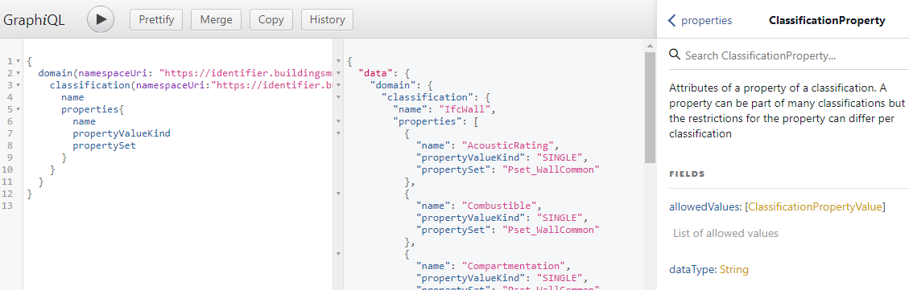

The buildingSmart Data Dictionary (bSDD) is an important shared resource in the Architecture, Engineering, Construction, and Operations (AECO) domain.
It is a collection of datasets ("domains") that define various classifications (objects representing building components, products, and materials),
their properties, allowed values, etc.
bSDD defines a GraphQL API, as well as REST APIs that return JSON and RDF representations.
This improves the interoperability of bSDD and its easier deployment in architectural Computer Aided Design (CAD) and other AECO software.

However, bSDD data is not structured as well as possible, and data retrieved via different APIs is not identical in content and structure.
This lowers bSDD data quality, usability and trust.

We conduct a thorough comparison and analysis of bSDD data related to fulfillment of FAIR (findable, accessible, interoperable, and reusable) principles.
Based on this analysis, we suggest enhancements to make bSDD data better structured and more FAIR.

We implement many of the suggestions by refactoring the original data to make it better structured/interconnected, and more "semantic".
We provide a SPARQL endpoint using [Ontotext GraphDB](https://graphdb.ontotext.com/), and GraphQL endpoint using [Ontotext Platform Semantic Objects](https://platform.ontotext.com/semantic-objects/).

|**Links**| |
|---------|---------------------------------------------------------------------------|
|<https://bsdd.ontotext.com> This home page: schemas, data, sample queries| |
|<https://github.com/Accord-Project/bsdd> Technical work (open source): scripts to get and refactor data, obtain GraphQL schema, generate and refactor SOML||
|[README.html](https://bsdd.ontotext.com/README.html) Detailed description of the work we did, 40 pages|{style="clip-path: ellipse(100% 95% at 50% 0)"} |
|[new README.html](https://bsdd.ontotext.com/new/) |new README: left navigation pane, but some minor typographic problems |
|[paper.pdf](https://bsdd.ontotext.com/paper/paper.pdf) Accepted at 11th [Linked Data in Architecture and Construction Workshop (LDAC 2023)](https://linkedbuildingdata.net/ldac2023/), 15-16 June 2023 | |
|presentation: [html](https://bsdd.ontotext.com/presentation/presentation.html), [pdf](https://github.com/Accord-Project/bsdd/blob/main/presentation/SemanticBSDD-W3CLBD-15-May-2023.pdf)  Presentation at LDAC 2023, 15 June 2023 | {style="clip-path: ellipse(100% 95% at 50% 0)"}
| Webinars: video, transcript (if important, ask us to edit it), brief notes |* [24 Mar 2023 to ACCORD (17 participants from universities and industry, ACCORD project and external)](https://drive.google.com/drive/folders/1iVMezn9jgRtEdOwkybdLYrLAdSKl56WJ)  * [26 Apr 2023 to bSI (4 participants, including 2 from buildingSMART International)](https://drive.google.com/open?id=1iW05O6VcR4fhs2Q_vxM18s14tvHFejzY)  * [15 May 2023 to W3C Linked Building Data CG (20 participants from universities and industry)](https://github.com/w3c-lbd-cg/lbd/blob/gh-pages/minutes/W3C_LBDCG_Teleconf_20230515.pdf)  * 26 May 2023, <b style='color:red;'>Natural Language Querying with ChatGPT, SOML, and GraphQL</b> [Ontotext Last Friday presentation (40 participants from Ontotext)](https://t.co/mr0YQbJuNH)  * <b style='color:red;'>LDAC BSDD session</b> [We're looking forward to see you at that session, and please vote for the topics to be discussed!](https://forums.buildingsmart.org/t/bsdd-session-at-ldac-mid-june-2023/4700/5) {style="clip-path: ellipse(100% 95% at 50% 0)"}|
| Discussion at bSI forum: please contribute! | * [Changes to bSDD data model names](https://forums.buildingsmart.org/t/changes-to-bsdd-data-model-names/4753)  * [bSDD schema diagrams](https://forums.buildingsmart.org/t/bsdd-schema-diagrams/4719)  * [Semantic bSDD](https://forums.buildingsmart.org/t/semantic-bsdd/4669)  |
|**Refactored Endpoints**| |
|[Voyager Refactored](https://rawgit2.com/Accord-Project/bsdd/main/bsdd-graphql-voyager-refact.html) Refactored GraphQL schema visualization with Voyager ||
|PlantUML Overview Diagram: [png](img/bsdd-graphql-soml-diagram-overview.png) or [svg](http://www.plantuml.com/plantuml/svg/jP91Qzmm48Nl_XN2nq9CDj3BKa8WEVPG0ksfO6QbyLhiI39ZcIN_lbQrZZBnuhQK-3IUUP_UF5iFOmIEawEgjmOLkY6-A8VkW3pcbhQi2Il2BgeO5DjZ7vMnZ3hQuAlnPFq034xvO734GNs-hIfDC8wg_hAFRC4V9m9kUIBa_Rtwxcsi5Oo_Yw8yKZXWUxQnRnsoDJCtpkgl2OSZ9kBrfL08F0EG20r9_nWc7_aboPUwg0yXd9Be6Jjaz1gVWfuS-hpFgbj0WWFI33u51zOdzQKiaiuIjbqWWvpMI6tRMGtHXWp8LW7FoREVcMyS1kIOTrzUYewiFxrHFIELizytLvGq5wmShK_emJda5hnfNrULZ5ZywaZ-WxSnVW1Dc43PgVBdLTUUUjSqkrhTc9kvlcsQJxKqbTHUQJ7ywPN9lsu3sh2GkOJ5--5i9GQRbjccMEx-a6e0HX-b91dsbipZtxlUDStTxCeowFe-N5mPwUAKIpIL-1JgOpxZS2bNPjjH5hK8eVuvIdbIbFlbT75XfMolW2YSqUJBl17wlyvzG6ycHxy0) |{width=800} |
|PlantUML Full Diagram: [png](img/bsdd-graphql-soml-diagram.png) or [svg](http://www.plantuml.com/plantuml/svg/xLdVJnj747xtNt6YBstLe92sBoX2YO1Ag4b82RGlbQovtJ6UiZ-kitCELjt_lLulHrcudbUqYK754kYy_hwTdRcPRsVlNWK1bjQQqPGqLcWRcLSMROqSqf0YLWP71YTIYQ-OpgTIQM9KGjwDmWMv1XXivRp6W4tr_VFHI1a8eTfwkNjkV8tZZoJJiKKcJU32xbxr1jnv2-UuLK6u_bBzCNhvXJ2uq02ZaszkVjbRlDmrv2vsznOLwUKVqwBQsTxUMOoMluI66CpOUS46TCGui5XzMGUjT-FbLuig29Cx7oHHyCfhBC560tU0VzxmlFR-8hfwWXDaT0eFl6ejEea-tntztCuhCEWqS8Hh44p_JybYkTT3G24nW_51O9cE8MQ5WXYeVTywuNaCJtUz-Opupz91c6AQ6-0njmPvwV2PevGCyUBHkZe037DRU_CtzFcTg1YeqIn3SU0ja5i58rq-X70qyvNOlVD22czvqSynLqgsxpMkgJa3GSwQM7FwJ5HXzHbIw4BXMXBsZ4qHt7h68pVnfNW7TfsBZ0OXu46cBeEJ1W5fGv7z6N8WxuPAxcCKsEaokzwpRv0bIKltPPE22qfe1aBUnU0Kt__o4bNUELI2klCsoyWOrw__YPcKztXop7HERkszo3XdeT088uZdDrcv51ZI870wRp9mttw6hmS2F6W09-GeyihMWmsZMjavl6mCE2YdOb1CJJcUBBhGZzvvyUrt6UQrZNVaUFAXhOE0Y-f5JeOOXmQLCAdzbcF-hyM_GNSkq_MmrfBpRJXo4WTalfRn5a9O2pgT8bklvmuigLEq3J98oxYUI3Q1XcDzrPDrJLfXSgRbl0S6Yu9yi_H2KLdW9TZ6z5chmHWluzfVfbvQJL4bSGe7oUoYghqt2Ew6Bc3SliQXyHUenn04cSAAPU7oy5APDj0COoegic2YkGBYaUiX3kmhA5ElZoTl4KBB6CFQ-LTaaDmzLqfkUANtRsiQ444kAzjcEW-amFpKWXEIUGyf7XHMqAjy-HbCYp-Iqulg_TsX0LkCZG65-hZ-3PMKfrtYBL73n7nhdr5OewvTyNNOTsqyLQRgAsy2XXlCjjQKPW_bku_WfVpWsO8KtSAMT1dEaQm9smovC6eTj3zeNMioez22ES66CQ2JrUvpnfJwbPvsUq86nnDlD78ySCLXcf2AlDHyvqCFlqNgQaTbwqujmdxFsFFxzrQRxv0UTzDp_usrM9YvcxQueMGq8AYF9kfm9S_lm0xUdm6jlQ_KFZgbBK_YC7VUpMsEBLVP1oQUYNUz9v-WkTRDVF3JA2UZkHQoN3pxrvdBNxRQdfyslEOfM8iy1gV7wTH-nu4kmZqEFFuJ_GPsdQTp-TEv_EbSle5Z-I3h17zlYL5VqygC_S8aK1lCQKyF0HxuGu1X4kDAzL2lJl-5d9JQ7r0-xuE6f-QtyELNyGE9dV_50ucKaddwnGul7zdyoy0LV9RNON5NT-zkemjzy2nvtBj0NhqixVjinVLjLS_qi-LrlFbRUTkSitPlFKBvrLLwDVTeWBJrOdlxnT84PoRwZXR91AEvchmxU0_EdcQyTc1dZGCf7VPlkw6cP7G-sc-rC6nTPdPXw_qnsirDPhJgqvZiX7t8MFf4OtkTiRpMRaKrDXqVh_QWWNbxSk7keJXz2dEXO__xLRz2frjh_W80) |{style="clip-path: ellipse(100% 50% at 50% 50%)"} |
|[bsdd-graphql-soml.patch](https://github.com/Accord-Project/bsdd/blob/main/bsdd-graphql-soml.patch) Differences between original and refactored schema (as SOML)||
|<https://bsdd.ontotext.com/platform> Semantic Objects workbench: administrative interface for the Ontotext Platform implementing GraphQL (protected)|{width=1000}|
|<https://bsdd.ontotext.com/graphql> Refactored GraphQL endpoint|(protected) |
|<https://bsdd.ontotext.com/graphiql> Refactored GraphQL query editor||
|<https://bsdd.ontotext.com/graphdb> GraphDB Workbench: administrative interface for our semantic database|(protected) |
|<https://bsdd.ontotext.com/graphdb/repositories/bsdd> GraphDB SPARQL endpoint| |
|<https://bsdd.ontotext.com/graphdb/sparql> GraphDB SPARQL editor||
|<https://bsdd.ontotext.com/graphdb/graphs-visualizations> Visual Graph visualizations|{style="clip-path: ellipse(100% 95% at 50% 0)"} |
|**Original Endpoints**| |
|[Voyager Original](https://rawgit2.com/Accord-Project/bsdd/main/bsdd-graphql-voyager-orig.html) Original GraphQL schema visualization with Voyager ||
|[Analysis Sheet](https://docs.google.com/spreadsheets/d/1z_NRMlExlVuqWhBbSErQ9iiDBY4O_fKMd3avV3-NCmo/edit) Analysis of differences between GraphQL, JSON and RDF representations|{style="clip-path: ellipse(100% 95% at 50% 0)"}|
|<https://test.bsdd.buildingsmart.org/graphql> Original GraphQL endpoint|(protected)|
|<https://test.bsdd.buildingsmart.org/graphiql> Original GraphQL query editor|{style="clip-path: ellipse(100% 95% at 50% 0)"} |

|**Acknowledge** | | |
|---|----|-----------------------|
|Developed by|{width=200}          |[Ontotext (Sirma AI)](https://ontotext.com/)|
|Funded by   |{width=200}            |Horizon Europe [Project ACCORD](https://accordproject.eu/) (101056973)|
|Powered by  |{width=200}           |[Ontotext GraphDB](https://graphdb.ontotext.com/)|
|Powered by  |{width=200} |[Ontotext Platform Semantic Objects](https://platform.ontotext.com/semantic-objects/)|
|Data from   |{width=200}              |[buildingSMART Data Dictionary](https://www.buildingsmart.org/users/services/buildingsmart-data-dictionary/) |

